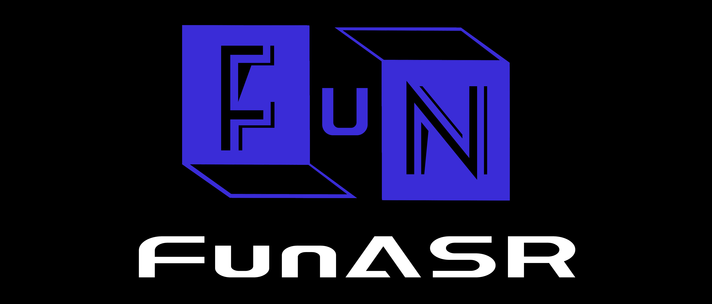

[//]: # '<div align="left"></div>'

(简体中文|[English](./README.md))

[](https://github.com/Akshay090/svg-banners)

[//]: # "# FunASR: A Fundamental End-to-End Speech Recognition Toolkit"

[](https://pypi.org/project/funasr/)

FunASR 希望在语音识别的学术研究和工业应用之间架起一座桥梁。通过发布工业级语音识别模型的训练和微调，研究人员和开发人员可以更方便地进行语音识别模型的研究和生产，并推动语音识别生态的发展。让语音识别更有趣！

<div align="center">
<h4>
 <a href="#核心功能"> 核心功能 </a>
｜<a href="#最新动态"> 最新动态 </a>
｜<a href="#安装教程"> 安装 </a>
｜<a href="#快速开始"> 快速开始 </a>
｜<a href="https://github.com/alibaba-damo-academy/FunASR/blob/main/docs/tutorial/README_zh.md"> 教程文档 </a>
｜<a href="#模型仓库"> 模型仓库 </a>
｜<a href="#服务部署"> 服务部署 </a>
｜<a href="#联系我们"> 联系我们 </a>
</h4>
</div>

<a name="核心功能"></a>

## 核心功能

- FunASR 是一个基础语音识别工具包，提供多种功能，包括语音识别（ASR）、语音端点检测（VAD）、标点恢复、语言模型、说话人验证、说话人分离和多人对话语音识别等。FunASR 提供了便捷的脚本和教程，支持预训练好的模型的推理与微调。
- 我们在[ModelScope](https://www.modelscope.cn/models?page=1&tasks=auto-speech-recognition)与[huggingface](https://huggingface.co/FunASR)上发布了大量开源数据集或者海量工业数据训练的模型，可以通过我们的[模型仓库](https://github.com/modelscope/FunASR/blob/main/model_zoo/readme_zh.md)了解模型的详细信息。代表性的[Paraformer](https://www.modelscope.cn/models/damo/speech_paraformer-large_asr_nat-zh-cn-16k-common-vocab8404-pytorch/summary)非自回归端到端语音识别模型具有高精度、高效率、便捷部署的优点，支持快速构建语音识别服务，详细信息可以阅读([服务部署文档](runtime/readme_cn.md))。

<a name="最新动态"></a>

## 最新动态

- 2026/05/20: 新增 Qwen3-ASR（0.6B/1.7B）多语言语音识别模型，支持52种语言自动语言检测。[使用示例](examples/industrial_data_pretraining/qwen3_asr)。
- 2026/05/20: 新增 GLM-ASR-Nano（1.5B）语音识别模型，支持17种语言，方言及低音量语音优化。[使用示例](examples/industrial_data_pretraining/glm_asr)。
- 2026/05/19: Fun-ASR-Nano 和 SenseVoice 现已支持说话人分离。配合 `vad_model` + `spk_model` + `punc_model` 使用，可获得带说话人标签的逐句结果。参见 [Fun-ASR-Nano demo](examples/industrial_data_pretraining/fun_asr_nano/demo_spk.py)、[SenseVoice demo](examples/industrial_data_pretraining/sense_voice/demo_spk.py)。
- 2025/12/15: [Fun-ASR-Nano-2512](https://github.com/FunAudioLLM/Fun-ASR) 是一款基于数千万小时真实语音数据训练的端到端语音识别大模型。它支持低延迟实时转写，并涵盖 31 种语言识别功能。
- 2024/10/29: 中文实时语音听写服务 1.12 发布，2pass-offline 模式支持 SensevoiceSmall 模型；详细信息参阅([部署文档](runtime/readme_cn.md))
- 2024/10/10：新增加 Whisper-large-v3-turbo 模型支持，多语言语音识别/翻译/语种识别，支持从 [modelscope](examples/industrial_data_pretraining/whisper/demo.py)仓库下载，也支持从 [openai](examples/industrial_data_pretraining/whisper/demo_from_openai.py)仓库下载模型。
- 2024/09/26: 中文离线文件转写服务 4.6、英文离线文件转写服务 1.7、中文实时语音听写服务 1.11 发布，修复 ONNX 内存泄漏、支持 SensevoiceSmall onnx 模型；中文离线文件转写服务 GPU 2.0 发布，修复显存泄漏; 详细信息参阅([部署文档](runtime/readme_cn.md))
- 2024/09/25：新增语音唤醒模型，支持[fsmn_kws](https://modelscope.cn/models/iic/speech_sanm_kws_phone-xiaoyun-commands-online), [fsmn_kws_mt](https://modelscope.cn/models/iic/speech_sanm_kws_phone-xiaoyun-commands-online), [sanm_kws](https://modelscope.cn/models/iic/speech_sanm_kws_phone-xiaoyun-commands-offline), [sanm_kws_streaming](https://modelscope.cn/models/iic/speech_sanm_kws_phone-xiaoyun-commands-online) 4 个模型的微调和推理。
- 2024/07/04：[SenseVoice](https://github.com/FunAudioLLM/SenseVoice) 是一个基础语音理解模型，具备多种语音理解能力，涵盖了自动语音识别（ASR）、语言识别（LID）、情感识别（SER）以及音频事件检测（AED）。
 
<details><summary>展开日志</summary>

- 2024/07/01：中文离线文件转写服务 GPU 版本 1.1 发布，优化 bladedisc 模型兼容性问题；详细信息参阅([部署文档](runtime/readme_cn.md))
- 2024/06/27：中文离线文件转写服务 GPU 版本 1.0 发布，支持动态 batch，支持多路并发，在长音频测试集上单线 RTF 为 0.0076，多线加速比为 1200+（CPU 为 330+）；详细信息参阅([部署文档](runtime/readme_cn.md))
- 2024/05/15：新增加情感识别模型，[emotion2vec+large](https://modelscope.cn/models/iic/emotion2vec_plus_large/summary)，[emotion2vec+base](https://modelscope.cn/models/iic/emotion2vec_plus_base/summary)，[emotion2vec+seed](https://modelscope.cn/models/iic/emotion2vec_plus_seed/summary)，输出情感类别为：生气/angry，开心/happy，中立/neutral，难过/sad。
- 2024/05/15: 中文离线文件转写服务 4.5、英文离线文件转写服务 1.6、中文实时语音听写服务 1.10 发布，适配 FunASR 1.0 模型结构；详细信息参阅([部署文档](runtime/readme_cn.md))
- 2024/03/05：新增加 Qwen-Audio 与 Qwen-Audio-Chat 音频文本模态大模型，在多个音频领域测试榜单刷榜，中支持语音对话，详细用法见 [示例](examples/industrial_data_pretraining/qwen_audio)。
- 2024/03/05：新增加 Whisper-large-v3 模型支持，多语言语音识别/翻译/语种识别，支持从 [modelscope](examples/industrial_data_pretraining/whisper/demo.py)仓库下载，也支持从 [openai](examples/industrial_data_pretraining/whisper/demo_from_openai.py)仓库下载模型。
- 2024/03/05: 中文离线文件转写服务 4.4、英文离线文件转写服务 1.5、中文实时语音听写服务 1.9 发布，docker 镜像支持 arm64 平台，升级 modelscope 版本；详细信息参阅([部署文档](runtime/readme_cn.md))
- 2024/01/30：funasr-1.0 发布，更新说明[文档](https://github.com/alibaba-damo-academy/FunASR/discussions/1319)
- 2024/01/30：新增加情感识别 [模型链接](https://www.modelscope.cn/models/iic/emotion2vec_base_finetuned/summary)，原始模型 [repo](https://github.com/ddlBoJack/emotion2vec).
- 2024/01/25: 中文离线文件转写服务 4.2、英文离线文件转写服务 1.3，优化 vad 数据处理方式，大幅降低峰值内存占用，内存泄漏优化；中文实时语音听写服务 1.7 发布，客户端优化；详细信息参阅([部署文档](runtime/readme_cn.md))
- 2024/01/09: funasr 社区软件包 windows 2.0 版本发布，支持软件包中文离线文件转写 4.1、英文离线文件转写 1.2、中文实时听写服务 1.6 的最新功能，详细信息参阅([FunASR 社区软件包 windows 版本](https://www.modelscope.cn/models/damo/funasr-runtime-win-cpu-x64/summary))
- 2024/01/03: 中文离线文件转写服务 4.0 发布，新增支持 8k 模型、优化时间戳不匹配问题及增加句子级别时间戳、优化英文单词 fst 热词效果、支持自动化配置线程参数，同时修复已知的 crash 问题及内存泄漏问题，详细信息参阅([部署文档](runtime/readme_cn.md#中文离线文件转写服务cpu版本))
- 2024/01/03: 中文实时语音听写服务 1.6 发布，2pass-offline 模式支持 Ngram 语言模型解码、wfst 热词，同时修复已知的 crash 问题及内存泄漏问题，详细信息参阅([部署文档](runtime/readme_cn.md#中文实时语音听写服务cpu版本))
- 2024/01/03: 英文离线文件转写服务 1.2 发布，修复已知的 crash 问题及内存泄漏问题，详细信息参阅([部署文档](runtime/readme_cn.md#英文离线文件转写服务cpu版本))
- 2023/12/04: funasr 社区软件包 windows 1.0 版本发布，支持中文离线文件转写、英文离线文件转写、中文实时听写服务，详细信息参阅([FunASR 社区软件包 windows 版本](https://www.modelscope.cn/models/damo/funasr-runtime-win-cpu-x64/summary))
- 2023/11/08：中文离线文件转写服务 3.0 CPU 版本发布，新增标点大模型、Ngram 语言模型与 wfst 热词，详细信息参阅([部署文档](runtime/readme_cn.md#中文离线文件转写服务cpu版本))
- 2023/10/17: 英文离线文件转写服务一键部署的 CPU 版本发布，详细信息参阅([部署文档](runtime/readme_cn.md#英文离线文件转写服务cpu版本))
- 2023/10/13: [SlideSpeech](https://slidespeech.github.io/): 一个大规模的多模态音视频语料库，主要是在线会议或者在线课程场景，包含了大量与发言人讲话实时同步的幻灯片。
- 2023.10.10: [Paraformer-long-Spk](https://github.com/alibaba-damo-academy/FunASR/blob/main/egs_modelscope/asr_vad_spk/speech_paraformer-large-vad-punc-spk_asr_nat-zh-cn/demo.py)模型发布，支持在长语音识别的基础上获取每句话的说话人标签。
- 2023.10.07: [FunCodec](https://github.com/alibaba-damo-academy/FunCodec): FunCodec 提供开源模型和训练工具，可以用于音频离散编码，以及基于离散编码的语音识别、语音合成等任务。
- 2023.09.01: 中文离线文件转写服务 2.0 CPU 版本发布，新增 ffmpeg、时间戳与热词模型支持，详细信息参阅([部署文档](runtime/readme_cn.md#中文离线文件转写服务cpu版本))
- 2023.08.07: 中文实时语音听写服务一键部署的 CPU 版本发布，详细信息参阅([部署文档](runtime/readme_cn.md#中文实时语音听写服务cpu版本))
- 2023.07.17: BAT 一种低延迟低内存消耗的 RNN-T 模型发布，详细信息参阅（[BAT](egs/aishell/bat)）
- 2023.06.26: ASRU2023 多通道多方会议转录挑战赛 2.0 完成竞赛结果公布，详细信息参阅（[M2MeT2.0](https://alibaba-damo-academy.github.io/FunASR/m2met2_cn/index.html)）

</details>

<a name="安装教程"></a>

## 安装教程

- 安装 funasr 之前，确保已经安装了下面依赖环境:

```text
python>=3.8
torch>=1.13
torchaudio
```

- pip 安装

```shell
pip3 install -U funasr
```

- 或者从源代码安装

```sh
git clone https://github.com/alibaba/FunASR.git && cd FunASR
pip3 install -e ./
```

如果需要使用工业预训练模型，安装 modelscope 与 huggingface_hub（可选）

```shell
pip3 install -U modelscope huggingface huggingface_hub
```

## 模型仓库

FunASR 开源了大量在工业数据上预训练模型，您可以在[模型许可协议](./MODEL_LICENSE)下自由使用、复制、修改和分享 FunASR 模型，下面列举代表性的模型，更多模型请参考 [模型仓库](./model_zoo)。

（注：⭐ 表示 ModelScope 模型仓库，🤗 表示 Huggingface 模型仓库，🍀 表示 OpenAI 模型仓库）

|                                                                                                     模型名字                                                                                                      |                           任务详情                           |       训练数据       |  参数量   |
|:-------------------------------------------------------------------------------------------------------------------------------------------------------------------------------------------------------------:|:--------------------------------------------------------:|:----------------:|:------:|
|                    Fun-ASR-Nano <br> ([⭐](https://www.modelscope.cn/models/FunAudioLLM/Fun-ASR-Nano-2512) [🤗](https://huggingface.co/FunAudioLLM/Fun-ASR-Nano-2512) )                                        | 语音识别，支持中文、英文与日语，其中中文支持7个方言，26个地方口音，英文与日语覆盖多地区口音，歌词识别，说唱等 |      数千万小时       |  800M  |
|                                  SenseVoiceSmall <br> ([⭐](https://www.modelscope.cn/models/iic/SenseVoiceSmall) [🤗](https://huggingface.co/FunAudioLLM/SenseVoiceSmall) )                                   | 多种语音理解能力，涵盖了自动语音识别（ASR）、语言识别（LID）、情感识别（SER）以及音频事件检测（AED） |   400000 小时，中文   |  330M  |
|    paraformer-zh <br> ([⭐](https://www.modelscope.cn/models/damo/speech_paraformer-large-vad-punc_asr_nat-zh-cn-16k-common-vocab8404-pytorch/summary) [🤗](https://huggingface.co/funasr/paraformer-zh) )     |                     语音识别，带时间戳输出，非实时                      |   60000 小时，中文    |  220M  |
| paraformer-zh-streaming <br> ( [⭐](https://modelscope.cn/models/damo/speech_paraformer-large_asr_nat-zh-cn-16k-common-vocab8404-online/summary) [🤗](https://huggingface.co/funasr/paraformer-zh-streaming) ) |                         语音识别，实时                          |   60000 小时，中文    |  220M  |
|         paraformer-en <br> ( [⭐](https://www.modelscope.cn/models/damo/speech_paraformer-large-vad-punc_asr_nat-en-16k-common-vocab10020/summary) [🤗](https://huggingface.co/funasr/paraformer-en) )         |                         语音识别，非实时                         |   50000 小时，英文    |  220M  |
|                      conformer-en <br> ( [⭐](https://modelscope.cn/models/damo/speech_conformer_asr-en-16k-vocab4199-pytorch/summary) [🤗](https://huggingface.co/funasr/conformer-en) )                      |                         语音识别，非实时                         |   50000 小时，英文    |  220M  |
|                        ct-punc <br> ( [⭐](https://modelscope.cn/models/damo/punc_ct-transformer_cn-en-common-vocab471067-large/summary) [🤗](https://huggingface.co/funasr/ct-punc) )                         |                           标点恢复                           |    100M，中文与英文    |  290M  |
|                            fsmn-vad <br> ( [⭐](https://modelscope.cn/models/damo/speech_fsmn_vad_zh-cn-16k-common-pytorch/summary) [🤗](https://huggingface.co/funasr/fsmn-vad) )                             |                        语音端点检测，实时                         |  5000 小时，中文与英文   |  0.4M  |
|                                                       fsmn-kws <br> ( [⭐](https://modelscope.cn/models/iic/speech_charctc_kws_phone-xiaoyun/summary) )                                                        |                         语音唤醒，实时                          |    5000 小时，中文    |  0.7M  |
|                              fa-zh <br> ( [⭐](https://modelscope.cn/models/damo/speech_timestamp_prediction-v1-16k-offline/summary) [🤗](https://huggingface.co/funasr/fa-zh) )                               |                         字级别时间戳预测                         |   50000 小时，中文    |  38M   |
|                                 cam++ <br> ( [⭐](https://modelscope.cn/models/iic/speech_campplus_sv_zh-cn_16k-common/summary) [🤗](https://huggingface.co/funasr/campplus) )                                 |                         说话人确认/分割                         |     5000 小时      |  7.2M  |
|                              ERes2NetV2 <br> ([⭐](examples/industrial_data_pretraining/eres2netv2_sv/demo.py) [⭐](https://modelscope.cn/models/iic/speech_eres2netv2_sv_zh-cn_16k-common/summary) )                               |                         说话人确认/分割                          |      5000小时       |  17.8M  |
|                                      Whisper-large-v3 <br> ([⭐](https://www.modelscope.cn/models/iic/Whisper-large-v3/summary) [🍀](https://github.com/openai/whisper) )                                      |                     语音识别，带时间戳输出，非实时                      |       多语言        | 1550 M |
|                                Whisper-large-v3-turbo <br> ([⭐](https://www.modelscope.cn/models/iic/Whisper-large-v3-turbo/summary) [🍀](https://github.com/openai/whisper) )                                |                     语音识别，带时间戳输出，非实时                      |       多语言        | 809 M  |
|                                         Qwen-Audio <br> ([⭐](examples/industrial_data_pretraining/qwen_audio/demo.py) [🤗](https://huggingface.co/Qwen/Qwen-Audio) )                                          |                     音频文本多模态大模型（预训练）                      |       多语言        |   8B   |
|                                  Qwen-Audio-Chat <br> ([⭐](examples/industrial_data_pretraining/qwen_audio/demo_chat.py) [🤗](https://huggingface.co/Qwen/Qwen-Audio-Chat) )                                  |                   音频文本多模态大模型（chat 版本）                    |       多语言        |   8B   |
|                                   Qwen3-ASR-1.7B <br> ([⭐](examples/industrial_data_pretraining/qwen3_asr/demo.py) [🤗](https://huggingface.co/Qwen/Qwen3-ASR-1.7B) [🤖](https://modelscope.cn/models/Qwen/Qwen3-ASR-1.7B) )                                   |                  语音识别，支持52种语言，自动语言检测                   |       多语言        |  1.7B  |
|                                   Qwen3-ASR-0.6B <br> ([⭐](examples/industrial_data_pretraining/qwen3_asr/demo.py) [🤗](https://huggingface.co/Qwen/Qwen3-ASR-0.6B) [🤖](https://modelscope.cn/models/Qwen/Qwen3-ASR-0.6B) )                                   |                  语音识别，支持52种语言，自动语言检测                   |       多语言        |  0.6B  |
|                                   GLM-ASR-Nano-2512 <br> ([⭐](examples/industrial_data_pretraining/glm_asr/demo.py) [🤗](https://huggingface.co/zai-org/GLM-ASR-Nano-2512) [🤖](https://modelscope.cn/models/ZhipuAI/GLM-ASR-Nano-2512) )                                   |               语音识别，支持17种语言，方言及低音量语音优化               |       多语言        |  1.5B  |
|                        emotion2vec+large <br> ([⭐](https://modelscope.cn/models/iic/emotion2vec_plus_large/summary) [🤗](https://huggingface.co/emotion2vec/emotion2vec_plus_large) )                         |                          情感识别模型                          | 40000 小时，4 种情感类别 |  300M  |

<a name="快速开始"></a>

## 快速开始

下面为快速上手教程，测试音频（[中文](https://isv-data.oss-cn-hangzhou.aliyuncs.com/ics/MaaS/ASR/test_audio/vad_example.wav)，[英文](https://isv-data.oss-cn-hangzhou.aliyuncs.com/ics/MaaS/ASR/test_audio/asr_example_en.wav)）

### 可执行命令行

```shell
funasr ++model=paraformer-zh ++vad_model="fsmn-vad" ++punc_model="ct-punc" ++input=asr_example_zh.wav
```

注：支持单条音频文件识别，也支持文件列表，列表为 kaldi 风格 wav.scp：`wav_id   wav_path`

### 非实时语音识别

#### Fun-ASR-Nano

```python
from funasr import AutoModel

model_dir = "FunAudioLLM/Fun-ASR-Nano-2512"

model = AutoModel(
    model=model_dir,
    vad_model="fsmn-vad",
    vad_kwargs={"max_single_segment_time": 30000},
    device="cuda:0",
)
res = model.generate(input=[wav_path], cache={}, batch_size_s=0)
text = res[0]["text"]
print(text)
```
参数说明：
- `model_dir`：模型名称，或本地磁盘中的模型路径。
- `vad_model`：表示开启 VAD，VAD 的作用是将长音频切割成短音频，此时推理耗时包括了 VAD 与 SenseVoice 总耗时，为链路耗时，如果需要单独测试 SenseVoice 模型耗时，可以关闭 VAD 模型。
- `vad_kwargs`：表示 VAD 模型配置,`max_single_segment_time`: 表示`vad_model`最大切割音频时长, 单位是毫秒 ms。
- `batch_size_s` 表示采用动态 batch，batch 中总音频时长，单位为秒 s。


#### Fun-ASR-Nano 说话人分离

```python
from funasr import AutoModel

model = AutoModel(
    model="FunAudioLLM/Fun-ASR-Nano-2512",
    trust_remote_code=True,
    remote_code="./model.py",
    vad_model="fsmn-vad",
    vad_kwargs={"max_single_segment_time": 30000},
    spk_model="cam++",
    punc_model="ct-punc",
    device="cuda:0",
)
res = model.generate(input="example.wav", cache={}, batch_size=1, language="中文")
# 结果包含 sentence_info，带有说话人标签
print(res[0]["sentence_info"])
# [{'text': '...', 'start': 420, 'end': 5580, 'timestamp': [...], 'spk': 0}]
```

#### SenseVoice

```python
from funasr import AutoModel
from funasr.utils.postprocess_utils import rich_transcription_postprocess

model_dir = "iic/SenseVoiceSmall"

model = AutoModel(
    model=model_dir,
    vad_model="fsmn-vad",
    vad_kwargs={"max_single_segment_time": 30000},
    device="cuda:0",
)

# en
res = model.generate(
    input=f"{model.model_path}/example/en.mp3",
    cache={},
    language="auto",  # "zn", "en", "yue", "ja", "ko", "nospeech"
    use_itn=True,
    batch_size_s=60,
    merge_vad=True,  #
    merge_length_s=15,
)
text = rich_transcription_postprocess(res[0]["text"])
print(text)
```

参数说明：

- `model_dir`：模型名称，或本地磁盘中的模型路径。
- `vad_model`：表示开启 VAD，VAD 的作用是将长音频切割成短音频，此时推理耗时包括了 VAD 与 SenseVoice 总耗时，为链路耗时，如果需要单独测试 SenseVoice 模型耗时，可以关闭 VAD 模型。
- `vad_kwargs`：表示 VAD 模型配置,`max_single_segment_time`: 表示`vad_model`最大切割音频时长, 单位是毫秒 ms。
- `use_itn`：输出结果中是否包含标点与逆文本正则化。
- `batch_size_s` 表示采用动态 batch，batch 中总音频时长，单位为秒 s。
- `merge_vad`：是否将 vad 模型切割的短音频碎片合成，合并后长度为`merge_length_s`，单位为秒 s。
- `ban_emo_unk`：禁用 emo_unk 标签，禁用后所有的句子都会被赋与情感标签。

#### Paraformer

```python
from funasr import AutoModel
# paraformer-zh is a multi-functional asr model
# use vad, punc, spk or not as you need
model = AutoModel(model="paraformer-zh",  vad_model="fsmn-vad", punc_model="ct-punc",
                  # spk_model="cam++"
                  )
res = model.generate(input=f"{model.model_path}/example/asr_example.wav",
            batch_size_s=300,
            hotword='魔搭')
print(res)
```

注：`hub`：表示模型仓库，`ms`为选择 modelscope 下载，`hf`为选择 huggingface 下载。

### 实时语音识别

```python
from funasr import AutoModel

chunk_size = [0, 10, 5] #[0, 10, 5] 600ms, [0, 8, 4] 480ms
encoder_chunk_look_back = 4 #number of chunks to lookback for encoder self-attention
decoder_chunk_look_back = 1 #number of encoder chunks to lookback for decoder cross-attention

model = AutoModel(model="paraformer-zh-streaming")

import soundfile
import os

wav_file = os.path.join(model.model_path, "example/asr_example.wav")
speech, sample_rate = soundfile.read(wav_file)
chunk_stride = chunk_size[1] * 960 # 600ms

cache = {}
total_chunk_num = int((len(speech)-1)/chunk_stride+1)
for i in range(total_chunk_num):
    speech_chunk = speech[i*chunk_stride:(i+1)*chunk_stride]
    is_final = i == total_chunk_num - 1
    res = model.generate(input=speech_chunk, cache=cache, is_final=is_final, chunk_size=chunk_size, encoder_chunk_look_back=encoder_chunk_look_back, decoder_chunk_look_back=decoder_chunk_look_back)
    print(res)
```

注：`chunk_size`为流式延时配置，`[0,10,5]`表示上屏实时出字粒度为`10*60=600ms`，未来信息为`5*60=300ms`。每次推理输入为`600ms`（采样点数为`16000*0.6=960`），输出为对应文字，最后一个语音片段输入需要设置`is_final=True`来强制输出最后一个字。

<details><summary>更多例子</summary>

### 语音端点检测（非实时）

```python
from funasr import AutoModel

model = AutoModel(model="fsmn-vad")

wav_file = f"{model.model_path}/example/vad_example.wav"
res = model.generate(input=wav_file)
print(res)
```

注：VAD 模型输出格式为：`[[beg1, end1], [beg2, end2], .., [begN, endN]]`，其中`begN/endN`表示第`N`个有效音频片段的起始点/结束点，
单位为毫秒。

### 语音端点检测（实时）

```python
from funasr import AutoModel

chunk_size = 200 # ms
model = AutoModel(model="fsmn-vad")

import soundfile

wav_file = f"{model.model_path}/example/vad_example.wav"
speech, sample_rate = soundfile.read(wav_file)
chunk_stride = int(chunk_size * sample_rate / 1000)

cache = {}
total_chunk_num = int((len(speech)-1)/chunk_stride+1)
for i in range(total_chunk_num):
    speech_chunk = speech[i*chunk_stride:(i+1)*chunk_stride]
    is_final = i == total_chunk_num - 1
    res = model.generate(input=speech_chunk, cache=cache, is_final=is_final, chunk_size=chunk_size)
    if len(res[0]["value"]):
        print(res)
```

注：流式 VAD 模型输出格式为 4 种情况：

- `[[beg1, end1], [beg2, end2], .., [begN, endN]]`：同上离线 VAD 输出结果。
- `[[beg, -1]]`：表示只检测到起始点。
- `[[-1, end]]`：表示只检测到结束点。
- `[]`：表示既没有检测到起始点，也没有检测到结束点
  输出结果单位为毫秒，从起始点开始的绝对时间。

### 标点恢复

```python
from funasr import AutoModel

model = AutoModel(model="ct-punc")

res = model.generate(input="那今天的会就到这里吧 happy new year 明年见")
print(res)
```

### 时间戳预测

```python
from funasr import AutoModel

model = AutoModel(model="fa-zh")

wav_file = f"{model.model_path}/example/asr_example.wav"
text_file = f"{model.model_path}/example/text.txt"
res = model.generate(input=(wav_file, text_file), data_type=("sound", "text"))
print(res)
```

### 情感识别

```python
from funasr import AutoModel

model = AutoModel(model="emotion2vec_plus_large")

wav_file = f"{model.model_path}/example/test.wav"

res = model.generate(wav_file, output_dir="./outputs", granularity="utterance", extract_embedding=False)
print(res)
```

更详细（[教程文档](docs/tutorial/README_zh.md)），
更多（[模型示例](https://github.com/alibaba-damo-academy/FunASR/tree/main/examples/industrial_data_pretraining)）

</details>

## 导出 ONNX

### 从命令行导出

```shell
funasr-export ++model=paraformer ++quantize=false
```

### 从 Python 导出

```python
from funasr import AutoModel

model = AutoModel(model="paraformer")

res = model.export(quantize=False)
```

### 测试 ONNX

```python
# pip3 install -U funasr-onnx
from pathlib import Path
from runtime.python.onnxruntime.funasr_onnx.paraformer_bin import Paraformer


home_dir = Path.home()

model_dir = "damo/speech_paraformer-large_asr_nat-zh-cn-16k-common-vocab8404-pytorch"
model = Paraformer(model_dir, batch_size=1, quantize=True)

wav_path = [f"{home_dir}/.cache/modelscope/hub/models/damo/speech_paraformer-large_asr_nat-zh-cn-16k-common-vocab8404-pytorch/example/asr_example.wav"]

result = model(wav_path)
print(result)
```

更多例子请参考 [样例](runtime/python/onnxruntime)

<a name="服务部署"></a>

## 服务部署

FunASR 支持预训练或者进一步微调的模型进行服务部署。目前支持以下几种服务部署：

- 中文离线文件转写服务（CPU 版本），已完成
- 中文流式语音识别服务（CPU 版本），已完成
- 英文离线文件转写服务（CPU 版本），已完成
- 中文离线文件转写服务（GPU 版本），进行中
- 更多支持中

详细信息可以参阅([服务部署文档](runtime/readme_cn.md))。

<a name="社区交流"></a>

## 联系我们

如果您在使用中遇到问题，可以直接在 github 页面提 Issues。欢迎语音兴趣爱好者扫描以下的钉钉群二维码加入社区群，进行交流和讨论。

|                               钉钉群                                |
| :-----------------------------------------------------------------: |
| <div align="left"> |

## 社区贡献者

| <div align="left"> | <div align="left"> |  </div> |  </div> |  </div> |  </div> |
| :----------------------------------------------------------------: | :-------------------------------------------------------------: | :-----------------------------------------------------------: | :-----------------------------------------------------: | :-------------------------------------------------------: | :----------------------------------------------------: |

贡献者名单请参考（[致谢名单](./Acknowledge.md)）

## 许可协议

项目遵循[The MIT License](https://opensource.org/licenses/MIT)开源协议，模型许可协议请参考（[模型协议](./MODEL_LICENSE)）

## 论文引用

```bibtex
@inproceedings{gao2023funasr,
  author={Zhifu Gao and Zerui Li and Jiaming Wang and Haoneng Luo and Xian Shi and Mengzhe Chen and Yabin Li and Lingyun Zuo and Zhihao Du and Zhangyu Xiao and Shiliang Zhang},
  title={FunASR: A Fundamental End-to-End Speech Recognition Toolkit},
  year={2023},
  booktitle={INTERSPEECH},
}
@inproceedings{An2023bat,
  author={Keyu An and Xian Shi and Shiliang Zhang},
  title={BAT: Boundary aware transducer for memory-efficient and low-latency ASR},
  year={2023},
  booktitle={INTERSPEECH},
}
@inproceedings{gao22b_interspeech,
  author={Zhifu Gao and ShiLiang Zhang and Ian McLoughlin and Zhijie Yan},
  title={{Paraformer: Fast and Accurate Parallel Transformer for Non-autoregressive End-to-End Speech Recognition}},
  year=2022,
  booktitle={Proc. Interspeech 2022},
  pages={2063--2067},
  doi={10.21437/Interspeech.2022-9996}
}
@article{shi2023seaco,
  author={Xian Shi and Yexin Yang and Zerui Li and Yanni Chen and Zhifu Gao and Shiliang Zhang},
  title={{SeACo-Paraformer: A Non-Autoregressive ASR System with Flexible and Effective Hotword Customization Ability}},
  year=2023,
  journal={arXiv preprint arXiv:2308.03266(accepted by ICASSP2024)},
}
```
