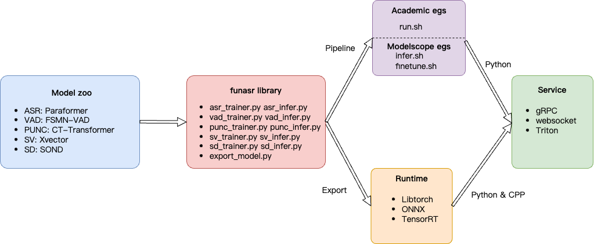

.. Funasr documentation master file, created by
   sphinx-quickstart on Tues Dec 6 19:05:00 2022.
   You can adapt this file completely to your liking, but it should at least
   contain the root `toctree` directive.

FunASR: A Fundamental End-to-End Speech Recognition Toolkit
============================================================
.. image:: ./images/funasr_logo.jpg

FunASR hopes to build a bridge between academic research and industrial applications on speech recognition. By supporting the training & finetuning of the industrial-grade speech recognition model released on `ModelScope <https://www.modelscope.cn/models?page=1&tasks=auto-speech-recognition>`_, researchers and developers can conduct research and production of speech recognition models more conveniently, and promote the development of speech recognition ecology. ASR for Fun！

Overview
============================================================

.. toctree::
   :maxdepth: 1
   :caption: Installation

   ./installation/installation.md
   ./installation/docker.md

.. toctree::
   :maxdepth: 5
   :caption: Quick Start

   ./funasr/quick_start.md

.. toctree::
   :maxdepth: 1
   :caption: Academic Egs

   ./academic_recipe/asr_recipe.md
   ./academic_recipe/punc_recipe.md
   ./academic_recipe/vad_recipe.md
   ./academic_recipe/sv_recipe.md
   ./academic_recipe/sd_recipe.md

.. toctree::
   :maxdepth: 1
   :caption: ModelScope Egs

   ./modelscope_pipeline/quick_start.md
   ./modelscope_pipeline/asr_pipeline.md
   ./modelscope_pipeline/vad_pipeline.md
   ./modelscope_pipeline/punc_pipeline.md
   ./modelscope_pipeline/tp_pipeline.md
   ./modelscope_pipeline/sv_pipeline.md
   ./modelscope_pipeline/sd_pipeline.md
   ./modelscope_pipeline/itn_pipeline.md

.. toctree::
   :maxdepth: 1
   :caption: Huggingface Egs

   Undo

.. toctree::
   :maxdepth: 1
   :caption: Model Zoo

   ./model_zoo/modelscope_models.md
   ./model_zoo/huggingface_models.md

.. toctree::
   :maxdepth: 1
   :caption: Runtime and Service

   ./runtime/export.md
   ./runtime/onnxruntime_python.md
   ./runtime/onnxruntime_cpp.md
   ./runtime/libtorch_python.md
   ./runtime/html5.md
   ./runtime/websocket_python.md
   ./runtime/websocket_cpp.md
   ./runtime/grpc_python.md
   ./runtime/grpc_cpp.md

.. toctree::
   :maxdepth: 1
   :caption: Benchmark and Leaderboard

   ./benchmark/benchmark_onnx.md
   ./benchmark/benchmark_onnx_cpp.md
   ./benchmark/benchmark_libtorch.md
   ./benchmark/benchmark_pipeline_cer.md

.. toctree::
   :maxdepth: 1
   :caption: Funasr Library

   ./reference/build_task.md

.. toctree::
   :maxdepth: 1
   :caption: Papers

   ./reference/papers.md

.. toctree::
   :maxdepth: 1
   :caption: Application

   ./reference/application.md

.. toctree::
   :maxdepth: 1
   :caption: FQA

   ./reference/FQA.md

Indices and tables
==================

* :ref:`genindex`
* :ref:`modindex`
* :ref:`search`
