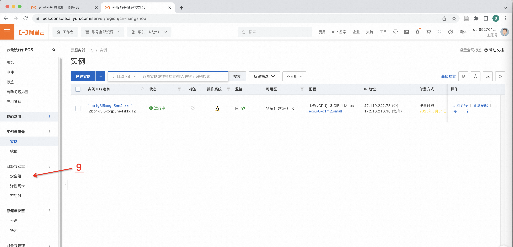
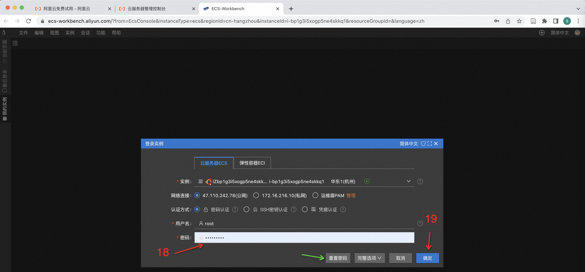

# 云服务器申请教程
我们以阿里云（[点此链接](https://www.aliyun.com/)）为例，演示如何申请云服务器

## 服务器配置
用户可以根据自己的业务需求，选择合适的服务器配置，推荐配置为：
- 配置一（高配）：X86架构，32/64核8369CPU，内存8G以上；
- 配置二：X86架构，32/64核8132CPU，内存8G以上；

详细性能测试报告：[点此链接](../../funasr/runtime/python/benchmark_onnx_cpp.md)

我们以免费试用（1～3个月）为例，演示如何申请服务器流程，图文步骤如下：

### 登陆个人账号
打开阿里云官网[点此链接](https://www.aliyun.com/)，注册并登陆个人账号，如下图标号1所示

### 免费试用

点击如上图所以标号2，出现如下界面

再点击标号3，出现如下界面

### 申请ECS实例

个人账号可以免费试用1核2GB内存，每月750小时，企业认证后，可以免费试用2核8GB内存 3个月，根据账号情况，点击上图中标号4，出现如下界面：

依次按照上图标号5、6、7选择后，点击立即试用，出现如下界面

### 开放服务端口

点击安全组（标号9），出现如下界面

再点击标号10，出现如下界面

点击手动添加（标号11），分别按照标号12、13填入内容，后点击保存（标号14），再点击实例（标号15），出现如下界面

### 启动ECS示例

点击示例名称（标号16），出现如下页面

点击远程启动（标号17），出现页面后，点击立即登陆，出现如下界面

首次登陆需要点击重置密码（上图中绿色箭头），设置好密码后，输入密码（标号18），点击确认（标号19）

首次登陆会遇到上图所示问题，点击标号20，根据文档操作后，重新登陆，登陆成功后出现如下页面

上图表示已经成功申请了云服务器，后续可以根据FunASR runtime-SDK部署文档进行一键部署（[点击此处]()）

