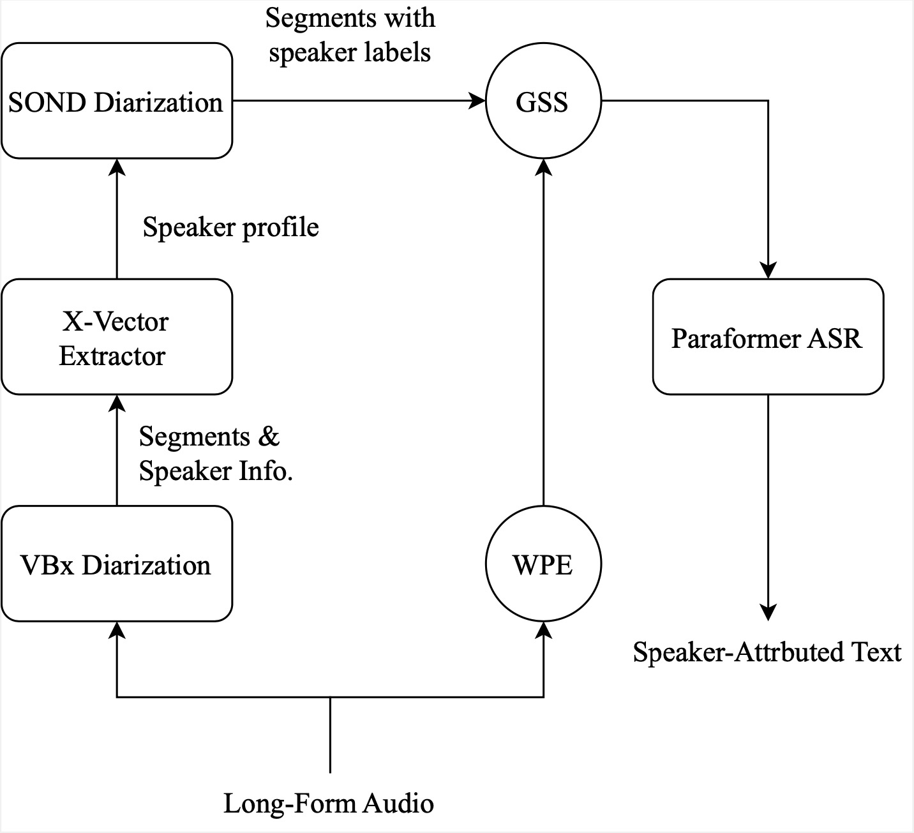

# Get Started
This is an official modular SA-ASR system used in M2MeT 2.0 challenge. We developed this system based on various pre-trained models after the challenge and reach the ***SOTA***(until 2023.8.9) performance on the AliMeeting *Test_2023* set. You can also transcribe your own dataset by preparing it into the specific format shown in 

# Dependency

To run this receipe, you should install [Kaldi](https://github.com/kaldi-asr/kaldi) and set the `KALDI_ROOT` in `path.sh`.
```shell
export KALDI_ROOT=/your_kaldi_path
```

We use the [VBx](https://github.com/BUTSpeechFIT/VBx) to provide initial diarization result to SOND and [dscore](https://github.com/nryant/dscore.git) to compute the DER. You should clone them before running this receipe.
```shell
$ mkdir VBx && cd VBx
$ git init 
$ git remote add origin https://github.com/BUTSpeechFIT/VBx.git
$ git config core.sparsecheckout true
$ echo "VBx/*" >> .git/info/sparse-checkout
$ git pull origin master
$ mv VBx/* .
$ cd ..
$ git clone https://github.com/nryant/dscore.git
```

We use the [pb_chime5](https://github.com/fgnt/pb_chime5) to perform GSS. So you should install the dependencies of this repo using the following command.
```shell
$ git clone https://github.com/fgnt/pb_chime5.git
$ cd pb_chime5
$ git submodule init  
$ git submodule update
$ pip install -e pb_bss/
$ pip install -e . 
```

# Infer on the AliMeeting Test_2023 set
We follow the workflow shown below.

<div align="left">

First you should set the `DATA_SOURCE` in `path.sh` to the data path. Your data path should be organized as follow:
```shell
Test_2023_Ali_far_release
|—— audio_dir/
|	|—— R1014_M1710.wav
|	|—— R1014_M1750.wav
|	|—— ...
|—— textgrid_dir/
|	|—— R1014_M1710.textgrid
|	|—— R1014_M1750.textgrid
|	|—— ...
|—— wav.scp
|—— segments
```

Then you can do speaker diarization with following command.
```shell
$ bash run_diar.sh
```
After diarization, you can check the result at the last line of `data/Test_2023_Ali_far_sond/dia_outputs/dia_result`. You should get a DER about 1.51%.

When you get the similar diarization result with us, then you can do the WPE and GSS using the following command.
```shell
$ bash run_enh.sh 8
```

The number 8 should be replaced with the channel number of your dataset. Here we use the AliMeeting corpus which has 8 channels.

Finally, you can decode the processed audio with the pre-trained ASR model directly using the flollowing commands.
```shell
$ bash run_asr.sh --stage 0 --stop-stage 1
$ bash run_asr.sh --stage 3 --stop-stage 3
```
The ASR result is saved at `./speech_paraformer-large_asr_nat-zh-cn-16k-common-vocab8404-pytorch/decode_Test_2023_Ali_far_wpegss/text_cpcer`. 

# Infer on the AliMeeting Test_2023 set after finetune
You can finetune the pre-trained ASR model with the AliMeeting train set to obtain a further reduction on the cpCER. To infer on the AliMeeting Test 2023 set after finetuning, you can run this commands after the train set is processed with WPE and GSS mentioned above.
 ```shell
$ bash run_asr.sh --stage 2 --stop-stage 3
```

# Infer with your own dataset
We also support infer with your own dataset. Your dataset should be organized as above. The `wav.scp` and `segments` file should format as:
 ```shell
# wav.scp
sessionA wav_path/wav_name_A.wav 
sessionB wav_path/wav_name_B.wav 
sessionC wav_path/wav_name_C.wav 
...

# segments
sessionA-start_time-end_time sessionA start_time end_time
sessionB-start_time-end_time sessionA start_time end_time
sessionC-start_time-end_time sessionA start_time end_time
...
```
Then you should set the `DATA_SOURCE` and `DATA_NAME` in `path.sh`. The rest of the process is the same as [Infer on the AliMeeting Test_2023 set](#infer-on-the-alimeeting-test_2023-set).

# Result 

|                |VBx DER(%)     | SOND DER(%)|cp-CER(%)  |
|:---------------|:------------:|:------------:|----------:|
|before finetune  |  16.87       |  1.51     |  10.18    |
|after finetune |     16.87    |   1.51   |    **8.84**  |

