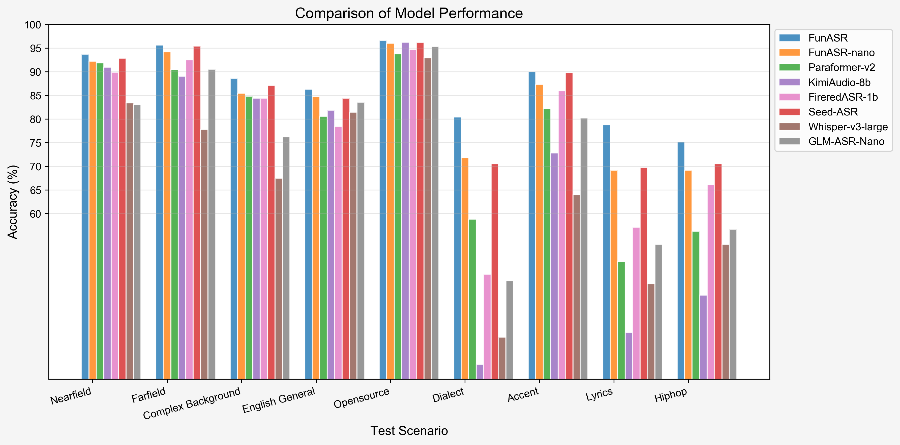

# Fun-ASR

「[简体中文](README_zh.md)」|「English」

Fun-ASR is an end-to-end speech recognition large model launched by Tongyi Lab. It is trained on tens of millions of hours of real speech data, possessing powerful contextual understanding capabilities and industry adaptability. It supports low-latency real-time transcription and covers 31 languages. It excels in vertical domains such as education and finance, accurately recognizing professional terminology and industry expressions, effectively addressing challenges like "hallucination" generation and language confusion, achieving "clear hearing, understanding meaning, and accurate writing."

<div align="center">

</div>

<div align="center">
<h4>
<a href="https://funaudiollm.github.io/funasr"> Homepage </a>
｜<a href="#core-features"> Core Features </a>
｜<a href="#performance-evaluation"> Performance Evaluation </a>
｜<a href="#environment-setup"> Environment Setup </a>
｜<a href="#usage-tutorial"> Usage Tutorial </a>

</h4>

Model Repository: [modelscope](https://www.modelscope.cn/models/FunAudioLLM/Fun-ASR-Nano-2512), [huggingface](https://huggingface.co/FunAudioLLM/Fun-ASR-Nano-2512)

Online Experience:
[ModelScope Community Space](https://modelscope.cn/studios/FunAudioLLM/Fun-ASR-Nano), [huggingface space](https://huggingface.co/spaces/FunAudioLLM/Fun-ASR-Nano)

</div>

|                                                                           Model Name                                                                            |                                                                                                                                                                                                       Task Details                                                                                                                                                                                                       |         Training Data          | Parameters |
| :-------------------------------------------------------------------------------------------------------------------------------------------------------------: | :----------------------------------------------------------------------------------------------------------------------------------------------------------------------------------------------------------------------------------------------------------------------------------------------------------------------------------------------------------------------------------------------------------------------: | :----------------------------: | :--------: |
|       Fun-ASR-Nano <br> ([⭐](https://www.modelscope.cn/models/FunAudioLLM/Fun-ASR-Nano-2512) [🤗](https://huggingface.co/FunAudioLLM/Fun-ASR-Nano-2512))       | Speech recognition supports Chinese, English, and Japanese. Chinese includes support for 7 dialects (Wu, Cantonese, Min, Hakka, Gan, Xiang, Jin) and 26 regional accents (Henan, Shanxi, Hubei, Sichuan, Chongqing, Yunnan, Guizhou, Guangdong, Guangxi and more than 20 other regions). English and Japanese cover multiple regional accents. Additional features include lyric recognition and rap speech recognition. |   Tens of millions of hours    |    800M    |
| Fun-ASR-MLT-Nano <br> ([⭐](https://www.modelscope.cn/models/FunAudioLLM/Fun-ASR-MLT-Nano-2512) [🤗](https://huggingface.co/FunAudioLLM/Fun-ASR-MLT-Nano-2512)) |                                    Speech recognition supports Chinese, English, Cantonese, Japanese, Korean, Vietnamese, Indonesian, Thai, Malay, Filipino, Arabic, Hindi, Bulgarian, Croatian, Czech, Danish, Dutch, Estonian, Finnish, Greek, Hungarian, Irish, Latvian, Lithuanian, Maltese, Polish, Portuguese, Romanian, Slovak, Slovenian, Swedish, and 31 languages in total.                                    | Hundreds of thousands of hours |    800M    |

<a name="What's News"></a>

# What's New 🔥

- 2025/12: [Fun-ASR-Nano-2512](https://modelscope.cn/models/FunAudioLLM/Fun-ASR-Nano-2512) is an end-to-end speech recognition large model trained on tens of millions of hours real speech data. It supports low-latency real-time transcription and covers 31 languages.
- 2024/7: [FunASR](https://github.com/modelscope/FunASR) is a fundamental speech recognition toolkit that offers a variety of features, including speech recognition (ASR), Voice Activity Detection (VAD), Punctuation Restoration, Language Models, Speaker Verification, Speaker Diarization and multi-talker ASR.

# Core Features 🎯

**Fun-ASR** focuses on high-precision speech recognition, multi-language support, and industry customization capabilities

- **Far-field High-noise Recognition:** Deeply optimized for far-distance sound pickup and high-noise scenarios (such as conference rooms, in-vehicle environments, industrial sites, etc.), improving recognition accuracy to **93%**.
- **Chinese Dialects and Regional Accents:**
  - Supports **7 major dialects**: Wu, Cantonese, Min, Hakka, Gan, Xiang, Jin
  - Covers **26 regional accents**: including Henan, Shaanxi, Hubei, Sichuan, Chongqing, Yunnan, Guizhou, Guangdong, Guangxi and more than 20 other regions
- **Multi-language Free Speech:** Supports recognition of **31 languages**, with focused optimization on East and Southeast Asian languages, supporting free language switching and mixed recognition.
- **Music Background Lyric Recognition:** Enhanced speech recognition performance under music background interference, supporting accurate recognition of lyric content in songs.

# Environment Setup 🐍

```shell
git clone https://github.com/FunAudioLLM/Fun-ASR.git
cd Fun-ASR
pip install -r requirements.txt
```

<a name="usage-tutorial"></a>

# TODO

- [x] Support returning timestamps
- [ ] Support speaker diarization
- [x] Support model training

# Usage 🛠️

## Inference

### Using funasr for inference

```python
from funasr import AutoModel


def main():
    model_dir = "FunAudioLLM/Fun-ASR-Nano-2512"
    model = AutoModel(
        model=model_dir,
        trust_remote_code=True,
        remote_code="./model.py",
        device="cuda:0",
        # hub：download models from ms (for ModelScope) or hf (for Hugging Face).
        hub="hf"
    )

    wav_path = f"{model.model_path}/example/zh.mp3"
    res = model.generate(
        input=[wav_path],
        cache={},
        batch_size=1,
        hotwords=["开放时间"],
        # 中文、英文、日文 for Fun-ASR-Nano-2512
        # 中文、英文、粤语、日文、韩文、越南语、印尼语、泰语、马来语、菲律宾语、阿拉伯语、
        # 印地语、保加利亚语、克罗地亚语、捷克语、丹麦语、荷兰语、爱沙尼亚语、芬兰语、希腊语、
        # 匈牙利语、爱尔兰语、拉脱维亚语、立陶宛语、马耳他语、波兰语、葡萄牙语、罗马尼亚语、
        # 斯洛伐克语、斯洛文尼亚语、瑞典语 for Fun-ASR-MLT-Nano-2512
        language="中文",
        itn=True, # or False
    )
    text = res[0]["text"]
    print(text)

    model = AutoModel(
        model=model_dir,
        trust_remote_code=True,
        vad_model="fsmn-vad",
        vad_kwargs={"max_single_segment_time": 30000},
        remote_code="./model.py",
        device="cuda:0",
    )
    res = model.generate(input=[wav_path], cache={}, batch_size=1)
    text = res[0]["text"]
    print(text)


if __name__ == "__main__":
    main()
```

### Direct Inference

```python
from model import FunASRNano


def main():
    model_dir = "FunAudioLLM/Fun-ASR-Nano-2512"
    m, kwargs = FunASRNano.from_pretrained(model=model_dir, device="cuda:0")
    m.eval()

    wav_path = f"{kwargs['model_path']}/example/zh.mp3"
    res = m.inference(data_in=[wav_path], **kwargs)
    text = res[0][0]["text"]
    print(text)


if __name__ == "__main__":
    main()
```

<details><summary> Parameter Description (click to expand) </summary>

- `model_dir`: Model name or local disk model path.
- `trust_remote_code`: Whether to trust remote code for loading custom model implementations.
- `remote_code`: Specify the location of specific model code (e.g., `model.py` in the current directory), supporting both absolute and relative paths.
- `device`: Specify the device to use, such as "cuda:0" or "cpu".

</details>

# Finetune

Please refer to [docs/finetune.md](docs/finetune.md)

# Performance 📝

We evaluated Fun-ASR against other state-of-the-art models on open-source benchmarks, Chinese dialect datasets, and industry-specific test sets. The results demonstrate that Fun-ASR achieves superior performance across various scenarios.

### 1. Open-Source Dataset Performance (WER %)

| Test set            | GLM-ASR-nano | GLM-ASR-nano\* | Whisper-large-v3 | Seed-ASR | Seed-ASR\* | Kimi-Audio | Step-Audio2 | FireRed-ASR | Fun-ASR-nano | Fun-ASR |
| :------------------ | :----------: | :------------: | :--------------: | :------: | :--------: | :--------: | :---------: | :---------: | :----------: | :-----: |
| **Model Size**      |     1.5B     |      1.5B      |       1.6B       |    -     |     -      |     -      |      -      |    1.1B     |     0.8B     |  7.7B   |
| **OpenSource**      |      ✅      |       ✅       |        ✅        |    ❌    |     ❌     |     ✅     |     ✅      |     ✅      |      ✅      |   ❌    |
| AIShell1            |     1.81     |      2.17      |       4.72       |   0.68   |    1.63    |    0.71    |    0.63     |    0.54     |     1.80     |  1.22   |
| AIShell2            |      -       |      3.47      |       4.68       |   2.27   |    2.76    |    2.86    |    2.10     |    2.58     |     2.75     |  2.39   |
| Fleurs-zh           |      -       |      3.65      |       5.18       |   3.43   |    3.23    |    3.11    |    2.68     |    4.81     |     2.56     |  2.53   |
| Fleurs-en           |     5.78     |      6.95      |       6.23       |   9.39   |    9.39    |    6.99    |    3.03     |    10.79    |     5.96     |  4.74   |
| Librispeech-clean   |     2.00     |      2.17      |       1.86       |   1.58   |    2.8     |    1.32    |    1.17     |    1.84     |     1.76     |  1.51   |
| Librispeech-other   |     4.19     |      4.43      |       3.43       |   2.84   |    5.69    |    2.63    |    2.42     |    4.52     |     4.33     |  3.03   |
| WenetSpeech Meeting |     6.73     |      8.21      |      18.39       |   5.69   |    7.07    |    6.24    |    4.75     |    4.95     |     6.60     |  6.17   |
| WenetSpeech Net     |      -       |      6.33      |      11.89       |   4.66   |    4.84    |    6.45    |    4.67     |    4.94     |     6.01     |  5.46   |

> _Note: Seed-ASR\* results are evaluated using the official API on volcengine; GLM-ASR-nano\* results are evaluated using the open-source checkpoint._

### 2. Industry Dataset Performance (WER %)

| Test set           | GLM-ASR-Nano | Whisper-large-v3 | Seed-ASR  | FireRed-ASR | Kimi-Audio | Paraformer v2 | Fun-ASR-nano |  Fun-ASR  |
| :----------------- | :----------: | :--------------: | :-------: | :---------: | :--------: | :-----------: | :----------: | :-------: |
| **Model Size**     |     1.5B     |       1.6B       |     -     |    1.1B     |     8B     |     0.2B      |     0.8B     |   7.7B    |
| **OpenSource**     |      ✅      |        ✅        |    ❌     |     ✅      |     ✅     |      ✅       |      ✅      |    ❌     |
| Nearfield          |    16.95     |      16.58       |   7.20    |    10.10    |    9.02    |     8.11      |     7.79     |   6.31    |
| Farfield           |     9.44     |      22.21       |   4.59    |    7.49     |   10.95    |     9.55      |     5.79     |   4.34    |
| Complex Background |    23.79     |      32.57       |   12.90   |    15.56    |   15.56    |     15.19     |    14.59     |   11.45   |
| English General    |    16.47     |      18.56       |   15.65   |    21.62    |   18.12    |     19.48     |    15.28     |   13.73   |
| Opensource         |     4.67     |       7.05       |   3.83    |    5.31     |    3.79    |     6.23      |     4.22     |   3.38    |
| Dialect            |    54.21     |      66.14       |   29.45   |    52.82    |   71.94    |     41.16     |    28.18     |   15.21   |
| Accent             |    19.78     |      36.03       |   10.23   |    14.05    |   27.20    |     17.80     |    12.90     |   10.31   |
| Lyrics             |    46.56     |      54.82       |   30.26   |    42.87    |   65.18    |     50.14     |    30.85     |   21.00   |
| Hiphop             |    43.32     |      46.56       |   29.46   |    33.88    |   57.25    |     43.79     |    30.87     |   28.58   |
| **Average**        |  **26.13**   |    **33.39**     | **15.95** |  **22.63**  | **31.00**  |   **23.49**   |  **16.72**   | **12.70** |

<div align="center">

</div>

## Remarkable Third-Party Work

- vLLM (GPU) Deployment Best Practices: An accelerated implementation of Fun-ASR using vLLM. [Repository](https://github.com/yuekaizhang/Fun-ASR-vllm)

## Citations

```bibtex
@misc{an2025funasrtechnicalreport,
      title={Fun-ASR Technical Report},
      author={Keyu An and Yanni Chen and Zhigao Chen and Chong Deng and Zhihao Du and Changfeng Gao and Zhifu Gao and Bo Gong and Xiangang Li and Yabin Li and Ying Liu and Xiang Lv and Yunjie Ji and Yiheng Jiang and Bin Ma and Haoneng Luo and Chongjia Ni and Zexu Pan and Yiping Peng and Zhendong Peng and Peiyao Wang and Hao Wang and Haoxu Wang and Wen Wang and Wupeng Wang and Yuzhong Wu and Biao Tian and Zhentao Tan and Nan Yang and Bin Yuan and Jieping Ye and Jixing Yu and Qinglin Zhang and Kun Zou and Han Zhao and Shengkui Zhao and Jingren Zhou and Yanqiao Zhu},
      year={2025},
      eprint={2509.12508},
      archivePrefix={arXiv},
      primaryClass={cs.CL},
      url={https://arxiv.org/abs/2509.12508},
}
```
