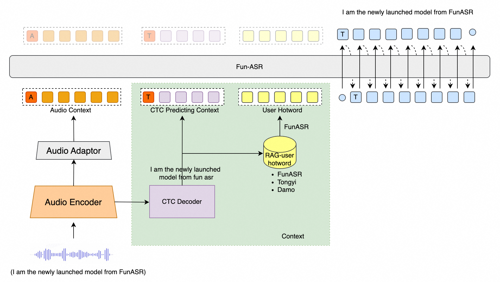
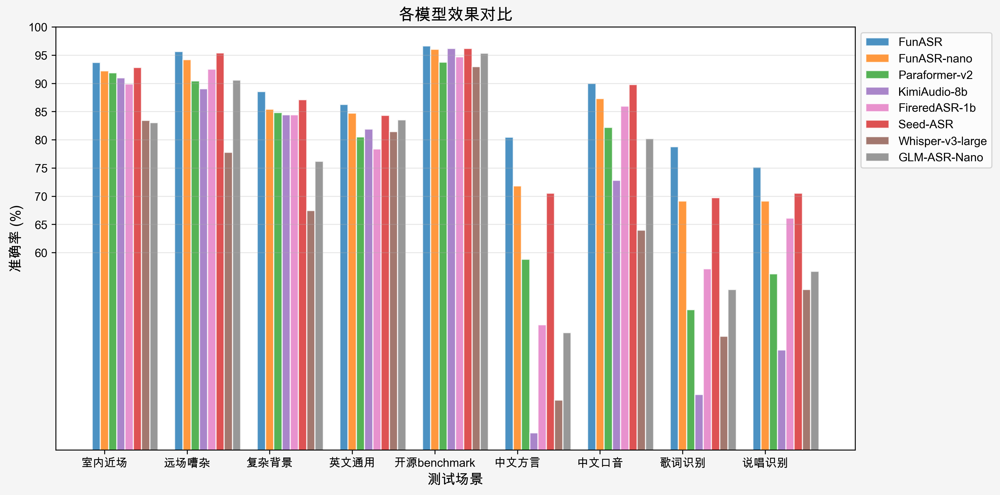

# Fun-ASR

「简体中文」|「[English](README.md)」

Fun-ASR 是通义实验室推出的端到端语音识别大模型，是基于数千万小时真实语音数据训练而成，具备强大的上下文理解能力与行业适应性，支持低延迟实时听写，并且覆盖 31 个语种。在教育、金融等垂直领域表现出色，能准确识别专业术语与行业表达，有效应对"幻觉"生成和语种混淆等挑战，实现"听得清、懂其意、写得准"。

<div align="center">

</div>

<div align="center">
<h4>
<a href="https://funaudiollm.github.io/funasr"> Homepage </a>
｜<a href="#核心特性"> 核心特性 </a>
｜<a href="#性能评测"> 性能评测 </a>
｜<a href="#环境安装"> 环境安装 </a>
｜<a href="#用法教程"> 用法教程 </a>

</h4>

模型仓库：[modelscope](https://www.modelscope.cn/models/FunAudioLLM/Fun-ASR-Nano-2512)，[huggingface](https://huggingface.co/FunAudioLLM/Fun-ASR-Nano-2512)

在线体验：
[魔搭社区创空间](https://modelscope.cn/studios/FunAudioLLM/Fun-ASR-Nano)，[huggingface space](https://huggingface.co/spaces/FunAudioLLM/Fun-ASR-Nano)

</div>

|                                                                              模型                                                                               |                                                                                                                                                    介绍                                                                                                                                                    |  训练数据  | 参数 |
| :-------------------------------------------------------------------------------------------------------------------------------------------------------------: | :--------------------------------------------------------------------------------------------------------------------------------------------------------------------------------------------------------------------------------------------------------------------------------------------------------: | :--------: | :--: |
|       Fun-ASR-Nano <br> ([⭐](https://www.modelscope.cn/models/FunAudioLLM/Fun-ASR-Nano-2512) [🤗](https://huggingface.co/FunAudioLLM/Fun-ASR-Nano-2512))       |         支持中文、英文、日文。中文包含 7 种方言（吴语、粤语、闽语、客家话、赣语、湘语、晋语）及 26 种地域口音支持（河南、陕西、湖北、四川、重庆、云南、贵州、广东、广西、河北、天津、山东、安徽、南京、江苏、杭州、甘肃、宁夏）。英文、日文涵盖多种地域口音。额外功能包括歌词识别与说唱语音识别。          | 数千万小时 | 8 亿 |
| Fun-ASR-MLT-Nano <br> ([⭐](https://www.modelscope.cn/models/FunAudioLLM/Fun-ASR-MLT-Nano-2512) [🤗](https://huggingface.co/FunAudioLLM/Fun-ASR-MLT-Nano-2512)) | 支持中文、英文、粤语、日文、韩文、越南语、印尼语、泰语、马来语、菲律宾语、阿拉伯语、印地语、保加利亚语、克罗地亚语、捷克语、丹麦语、荷兰语、爱沙尼亚语、芬兰语、希腊语、匈牙利语、爱尔兰语、拉脱维亚语、立陶宛语、马耳他语、波兰语、葡萄牙语、罗马尼亚语、斯洛伐克语、斯洛文尼亚语、瑞典语，共 31 种语言。 | 数十万小时 | 8 亿 |

<a name="最新动态"></a>

# 最新动态 🔥

- 2025/12: [Fun-ASR-Nano-2512](https://modelscope.cn/models/FunAudioLLM/Fun-ASR-Nano-2512) 是一款基于数千万小时真实语音数据训练的端到端语音识别大模型。它支持低延迟实时转写，并涵盖 31 种语言识别功能。
- 2024/7: [FunASR](https://github.com/modelscope/FunASR) 是一款功能全面的语音识别基础工具包，集成了多项核心功能，包括自动语音识别（ASR）、语音活动检测（VAD）、标点恢复、语言模型、说话人验证、说话人日志记录以及多说话人语音识别。

# 核心特性 🎯

**Fun-ASR** 专注于高精度语音识别、多语言支持和行业定制化能力

- **远场高噪声识别：** 针对远距离拾音及高噪声场景（如会议室、车载环境、工业现场等）进行深度优化，识别准确率提升至 **93%**。
- **中文方言与地方口音：**
  - 支持 **7 大方言**：吴语、粤语、闽语、客家话、赣语、湘语、晋语
  - 覆盖 **26 个地区口音**：包括河南、陕西、湖北、四川、重庆、云南、贵州、广东、广西等 20 多个地区
- **多语言自由说：** 支持 **31 种语言**识别，重点优化东亚与东南亚语种，支持语种自由切换和混合识别。
- **音乐背景歌词识别：** 强化在音乐背景干扰下的语音识别性能，支持对歌曲中歌词内容的精准识别。

# 环境安装 🐍

```shell
git clone https://github.com/FunAudioLLM/Fun-ASR.git
cd Fun-ASR
pip install -r requirements.txt
```

<a name="用法教程"></a>

# TODO

- [x] 支持返回时间戳
- [ ] 支持区分说话人识别
- [x] 支持模型训练

# 用法 🛠️

## 推理

### 使用 funasr 推理

```python
from funasr import AutoModel


def main():
    model_dir = "FunAudioLLM/Fun-ASR-Nano-2512"
    model = AutoModel(
        model=model_dir,
        trust_remote_code=True,
        remote_code="./model.py",
        device="cuda:0",
        hub="ms"
    )

    wav_path = f"{model.model_path}/example/zh.mp3"
    res = model.generate(
        input=[wav_path],
        cache={},
        batch_size=1,
        hotwords=["开放时间"],
        # 中文、英文、日文 for Fun-ASR-Nano-2512
        # 中文、英文、粤语、日文、韩文、越南语、印尼语、泰语、马来语、菲律宾语、阿拉伯语、
        # 印地语、保加利亚语、克罗地亚语、捷克语、丹麦语、荷兰语、爱沙尼亚语、芬兰语、希腊语、
        # 匈牙利语、爱尔兰语、拉脱维亚语、立陶宛语、马耳他语、波兰语、葡萄牙语、罗马尼亚语、
        # 斯洛伐克语、斯洛文尼亚语、瑞典语 for Fun-ASR-MLT-Nano-2512
        language="中文",
        itn=True, # or False
    )
    text = res[0]["text"]
    print(text)

    model = AutoModel(
        model=model_dir,
        trust_remote_code=True,
        vad_model="fsmn-vad",
        vad_kwargs={"max_single_segment_time": 30000},
        remote_code="./model.py",
        device="cuda:0",
    )
    res = model.generate(input=[wav_path], cache={}, batch_size=1)
    text = res[0]["text"]
    print(text)


if __name__ == "__main__":
    main()
```

### 直接推理

```python
from model import FunASRNano


def main():
    model_dir = "FunAudioLLM/Fun-ASR-Nano-2512"
    m, kwargs = FunASRNano.from_pretrained(model=model_dir, device="cuda:0")
    m.eval()

    wav_path = f"{kwargs['model_path']}/example/zh.mp3"
    res = m.inference(data_in=[wav_path], **kwargs)
    text = res[0][0]["text"]
    print(text)


if __name__ == "__main__":
    main()
```

<details><summary> 参数说明（点击展开）</summary>

- `model_dir`：模型名称，或本地磁盘中的模型路径。
- `trust_remote_code`：是否信任远程代码，用于加载自定义模型实现。
- `remote_code`：指定模型具体代码的位置（例如，当前目录下的 `model.py`），支持绝对路径与相对路径。
- `device`：指定使用的设备，如 "cuda:0" 或 "cpu"。

</details>

# 微调

详情请参考 [docs/finetune_zh.md](docs/finetune.md)

# 性能评测 📝

我们在开源基准数据集、中文方言测试集和工业测试集上，比较了 Fun-ASR 与其他模型的多语言语音识别性能。Fun-ASR 模型均具有明显的效果优势。

### 1. 开源数据集性能 (WER %)

| Test set            | GLM-ASR-nano | GLM-ASR-nano\* | Whisper-large-v3 | Seed-ASR | Seed-ASR\* | Kimi-Audio | Step-Audio2 | FireRed-ASR | Fun-ASR-nano | Fun-ASR |
| :------------------ | :----------: | :------------: | :--------------: | :------: | :--------: | :--------: | :---------: | :---------: | :----------: | :-----: |
| **Model Size**      |     1.5B     |      1.5B      |       1.6B       |    -     |     -      |     -      |      -      |    1.1B     |     0.8B     |  7.7B   |
| **OpenSource**      |      ✅      |       ✅       |        ✅        |    ❌    |     ❌     |     ✅     |     ✅      |     ✅      |      ✅      |   ❌    |
| AIShell1            |     1.81     |      2.17      |       4.72       |   0.68   |    1.63    |    0.71    |    0.63     |    0.54     |     1.80     |  1.22   |
| AIShell2            |      -       |      3.47      |       4.68       |   2.27   |    2.76    |    2.86    |    2.10     |    2.58     |     2.75     |  2.39   |
| Fleurs-zh           |      -       |      3.65      |       5.18       |   3.43   |    3.23    |    3.11    |    2.68     |    4.81     |     2.56     |  2.53   |
| Fleurs-en           |     5.78     |      6.95      |       6.23       |   9.39   |    9.39    |    6.99    |    3.03     |    10.79    |     5.96     |  4.74   |
| Librispeech-clean   |     2.00     |      2.17      |       1.86       |   1.58   |    2.8     |    1.32    |    1.17     |    1.84     |     1.76     |  1.51   |
| Librispeech-other   |     4.19     |      4.43      |       3.43       |   2.84   |    5.69    |    2.63    |    2.42     |    4.52     |     4.33     |  3.03   |
| WenetSpeech Meeting |     6.73     |      8.21      |      18.39       |   5.69   |    7.07    |    6.24    |    4.75     |    4.95     |     6.60     |  6.17   |
| WenetSpeech Net     |      -       |      6.33      |      11.89       |   4.66   |    4.84    |    6.45    |    4.67     |    4.94     |     6.01     |  5.46   |

> _注：Seed-ASR\* 结果使用 volcengine 上的官方 API 评估；GLM-ASR-nano\* 结果使用开源 checkpoint 评估。_

### 2. 工业数据集性能 (WER %)

| Test set           | GLM-ASR-Nano | Whisper-large-v3 | Seed-ASR  | FireRed-ASR | Kimi-Audio | Paraformer v2 | Fun-ASR-nano |  Fun-ASR  |
| :----------------- | :----------: | :--------------: | :-------: | :---------: | :--------: | :-----------: | :----------: | :-------: |
| **Model Size**     |     1.5B     |       1.6B       |     -     |    1.1B     |     8B     |     0.2B      |     0.8B     |   7.7B    |
| **OpenSource**     |      ✅      |        ✅        |    ❌     |     ✅      |     ✅     |      ✅       |      ✅      |    ❌     |
| Nearfield          |    16.95     |      16.58       |   7.20    |    10.10    |    9.02    |     8.11      |     7.79     |   6.31    |
| Farfield           |     9.44     |      22.21       |   4.59    |    7.49     |   10.95    |     9.55      |     5.79     |   4.34    |
| Complex Background |    23.79     |      32.57       |   12.90   |    15.56    |   15.56    |     15.19     |    14.59     |   11.45   |
| English General    |    16.47     |      18.56       |   15.65   |    21.62    |   18.12    |     19.48     |    15.28     |   13.73   |
| Opensource         |     4.67     |       7.05       |   3.83    |    5.31     |    3.79    |     6.23      |     4.22     |   3.38    |
| Dialect            |    54.21     |      66.14       |   29.45   |    52.82    |   71.94    |     41.16     |    28.18     |   15.21   |
| Accent             |    19.78     |      36.03       |   10.23   |    14.05    |   27.20    |     17.80     |    12.90     |   10.31   |
| Lyrics             |    46.56     |      54.82       |   30.26   |    42.87    |   65.18    |     50.14     |    30.85     |   21.00   |
| Hiphop             |    43.32     |      46.56       |   29.46   |    33.88    |   57.25    |     43.79     |    30.87     |   28.58   |
| **Average**        |  **26.13**   |    **33.39**     | **15.95** |  **22.63**  | **31.00**  |   **23.49**   |  **16.72**   | **12.70** |

<div align="center">

</div>

## 优秀三方工作

- vLLM (GPU) 最佳部署实践: 使用 vLLM 实现对 Fun-ASR 的加速. [Repository](https://github.com/yuekaizhang/Fun-ASR-vllm)

## Citations

```bibtex
@misc{an2025funasrtechnicalreport,
      title={Fun-ASR Technical Report},
      author={Keyu An and Yanni Chen and Zhigao Chen and Chong Deng and Zhihao Du and Changfeng Gao and Zhifu Gao and Bo Gong and Xiangang Li and Yabin Li and Ying Liu and Xiang Lv and Yunjie Ji and Yiheng Jiang and Bin Ma and Haoneng Luo and Chongjia Ni and Zexu Pan and Yiping Peng and Zhendong Peng and Peiyao Wang and Hao Wang and Haoxu Wang and Wen Wang and Wupeng Wang and Yuzhong Wu and Biao Tian and Zhentao Tan and Nan Yang and Bin Yuan and Jieping Ye and Jixing Yu and Qinglin Zhang and Kun Zou and Han Zhao and Shengkui Zhao and Jingren Zhou and Yanqiao Zhu},
      year={2025},
      eprint={2509.12508},
      archivePrefix={arXiv},
      primaryClass={cs.CL},
      url={https://arxiv.org/abs/2509.12508},
}
```
