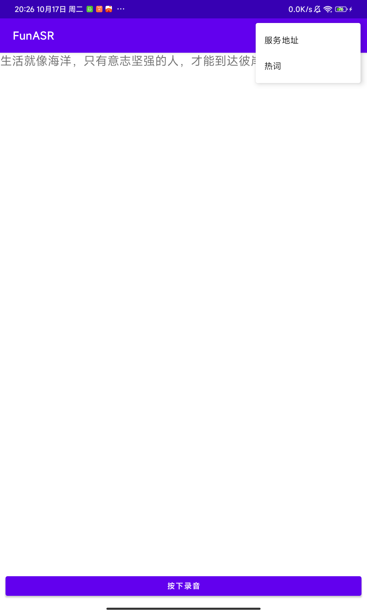

# AndroidClient

先说明，本项目是使用WebSocket连接服务器的语音识别服务，并不是将FunASR部署到Android里，服务启动方式请查看文档[SDK_advanced_guide_online_zh.md](https://github.com/alibaba-damo-academy/FunASR/blob/main/funasr/runtime/docs/SDK_advanced_guide_online_zh.md)。

使用最新的 Android Studio 打开`AndroidClient`项目，运行即可。也可以直接下载[APK安装包](https://yeyupiaoling.cn/AndroidClient.apk)安装使用，或者使用手机扫码下载。

  

应用只有一个功能，按钮下开始识别，松开按钮结束识别。第一次打开应用需要设置WebSocket的地址，也可以在菜单栏修改，同时也可以在菜单栏修改热词。

应用效果图：

  
  
  

