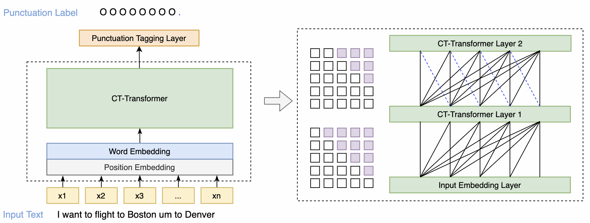

---
tasks:
- punctuation
domain:
- audio
model-type:
- Classification
frameworks:
- pytorch
metrics:
- f1_score
license: Apache License 2.0
language: 
- cn
tags:
- FunASR
- CT-Transformer
- Alibaba
- ICASSP 2020
datasets:
  train:
  - 33M-samples online data
  test:
  - wikipedia data test
  - 10000 industrial Mandarin sentences test
widgets:
  - task: punctuation
    inputs:
      - type: text
        name: input
        title: 文本
    examples:
      - name: 1
        title: 示例1
        inputs:
          - name: input
            data: 我们都是木头人不会讲话不会动
    inferencespec:
      cpu: 1 #CPU数量
      memory: 4096
---

# Controllable Time-delay Transformer模型介绍

[//]: # (Controllable Time-delay Transformer 模型是一种端到端标点分类模型。)

[//]: # (常规的Transformer会依赖很远的未来信息，导致长时间结果不固定。Controllable Time-delay Transformer 在效果无损的情况下，有效控制标点的延时。)

# Highlights
- 中文标点通用模型：可用于语音识别模型输出文本的标点预测。
  - 基于[Paraformer-large长音频模型](https://www.modelscope.cn/models/damo/speech_paraformer-large-vad-punc_asr_nat-zh-cn-16k-common-vocab8404-pytorch/summary)场景的使用
  - 基于[FunASR框架](https://github.com/alibaba-damo-academy/FunASR)，可进行ASR，VAD，标点的自由组合
  - 基于纯文本输入的标点预测

## <strong>[ModelScope-FunASR](https://github.com/alibaba-damo-academy/FunASR)</strong>
<strong>[FunASR](https://github.com/alibaba-damo-academy/FunASR)</strong>希望在语音识别方面建立学术研究和工业应用之间的桥梁。通过支持在ModelScope上发布的工业级语音识别模型的训练和微调，研究人员和开发人员可以更方便地进行语音识别模型的研究和生产，并促进语音识别生态系统的发展。

[**最新动态**](https://github.com/alibaba-damo-academy/FunASR#whats-new) 
| [**环境安装**](https://github.com/alibaba-damo-academy/FunASR#installation)
| [**介绍文档**](https://alibaba-damo-academy.github.io/FunASR/en/index.html)
| [**中文教程**](https://github.com/alibaba-damo-academy/FunASR/wiki#funasr%E7%94%A8%E6%88%B7%E6%89%8B%E5%86%8C)
| [**服务部署**](https://github.com/alibaba-damo-academy/FunASR/tree/main/funasr/runtime)
| [**模型库**](https://github.com/alibaba-damo-academy/FunASR/blob/main/docs/model_zoo/modelscope_models.md)
| [**联系我们**](https://github.com/alibaba-damo-academy/FunASR#contact)

## 项目介绍

Controllable Time-delay Transformer是达摩院语音团队提出的高效后处理框架中的标点模块。本项目为中文通用标点模型，模型可以被应用于文本类输入的标点预测，也可应用于语音识别结果的后处理步骤，协助语音识别模块输出具有可读性的文本结果。

<p align="center">


Controllable Time-delay Transformer 模型结构如上图所示，由 Embedding、Encoder 和 Predictor 三部分组成。Embedding 是词向量叠加位置向量。Encoder可以采用不同的网络结构，例如self-attention，conformer，SAN-M等。Predictor 预测每个token后的标点类型。

在模型的选择上采用了性能优越的Transformer模型。Transformer模型在获得良好性能的同时，由于模型自身序列化输入等特性，会给系统带来较大时延。常规的Transformer可以看到未来的全部信息，导致标点会依赖很远的未来信息。这会给用户带来一种标点一直在变化刷新，长时间结果不固定的不良感受。基于这一问题，我们创新性的提出了可控时延的Transformer模型（Controllable Time-Delay Transformer, CT-Transformer），在模型性能无损失的情况下，有效控制标点的延时。

更详细的细节见：
- 论文： [CONTROLLABLE TIME-DELAY TRANSFORMER FOR REAL-TIME PUNCTUATION PREDICTION AND DISFLUENCY DETECTION](https://arxiv.org/pdf/2003.01309.pdf)

## 如何使用与训练自己的模型

本项目提供的预训练模型是基于大数据训练的通用领域识别模型，开发者可以基于此模型进一步利用ModelScope的微调功能或者本项目对应的Github代码仓库[FunASR](https://github.com/alibaba-damo-academy/FunASR)进一步进行模型的领域定制化。

### 在Notebook中开发

对于有开发需求的使用者，特别推荐您使用Notebook进行离线处理。先登录ModelScope账号，点击模型页面右上角的“在Notebook中打开”按钮出现对话框，首次使用会提示您关联阿里云账号，按提示操作即可。关联账号后可进入选择启动实例界面，选择计算资源，建立实例，待实例创建完成后进入开发环境，进行调用。


#### 基于ModelScope进行推理

以下为三种支持格式及api调用方式参考如下范例：
- text.scp文件路径，例如example/punc_example.txt，格式为： key + "\t" + value
```sh
cat example/punc_example.txt
1       跨境河流是养育沿岸人民的生命之源
2       从存储上来说仅仅是全景图片它就会是图片的四倍的容量
3       那今天的会就到这里吧happy new year明年见
```
```python
from modelscope.pipelines import pipeline
from modelscope.utils.constant import Tasks

inference_pipline = pipeline(
    task=Tasks.punctuation,
    model='damo/punc_ct-transformer_zh-cn-common-vocab272727-pytorch',
    model_revision="v1.1.7")

rec_result = inference_pipline(text_in='example/punc_example.txt')
print(rec_result)
```
- text二进制数据，例如：用户直接从文件里读出bytes数据
```python
rec_result = inference_pipline(text_in='我们都是木头人不会讲话不会动')
```
- text文件url，例如：https://isv-data.oss-cn-hangzhou.aliyuncs.com/ics/MaaS/ASR/test_text/punc_example.txt
```python
rec_result = inference_pipline(text_in='https://isv-data.oss-cn-hangzhou.aliyuncs.com/ics/MaaS/ASR/test_text/punc_example.txt')
```


#### 基于ModelScope进行微调
待开发


### 在本地机器中开发

#### 基于ModelScope进行微调和推理

支持基于ModelScope上数据集及私有数据集进行定制微调和推理，使用方式同Notebook中开发。

#### 基于FunASR进行微调和推理

FunASR框架支持魔搭社区开源的工业级的语音识别模型的training & finetuning，使得研究人员和开发者可以更加便捷的进行语音识别模型的研究和生产，目前已在Github开源：https://github.com/alibaba-damo-academy/FunASR

#### FunASR框架安装

- 安装FunASR和ModelScope

```sh
pip install "modelscope[audio]" -f https://modelscope.oss-cn-beijing.aliyuncs.com/releases/repo.html
git clone https://github.com/alibaba/FunASR.git
cd FunASR
pip install --editable ./
```


#### 基于FunASR进行推理

接下来会以私有数据集为例，介绍如何在FunASR框架中使用本模型进行推理以及微调。

```sh
cd egs_modelscope/punctuation/punc_ct-transformer_zh-cn-common-vocab272727-pytorch/
python infer.py
```

#### 基于FunASR进行微调
待开发

## Benchmark
中文标点预测通用模型在自采集的通用领域业务场景数据上有良好效果。训练数据大约33M个sample，每个sample可能包含1句或多句。

### 自采集数据（20000+ samples）

| precision                            | recall                                | f1_score                              |
|:------------------------------------:|:-------------------------------------:|:-------------------------------------:|
| <div style="width: 150pt">53.8</div> | <div style="width: 150pt">60.0</div>  | <div style="width: 150pt">56.5</div>  | 

## 使用方式以及适用范围

运行范围
- 现阶段只能在Linux-x86_64运行，不支持Mac和Windows。

使用方式
- 直接推理：可以直接对输入文本进行计算，输出带有标点的目标文字。

使用范围与目标场景
- 适合对文本数据进行标点预测，文本长度不限。

## 相关论文以及引用信息

```BibTeX
@inproceedings{chen2020controllable,
  title={Controllable Time-Delay Transformer for Real-Time Punctuation Prediction and Disfluency Detection},
  author={Chen, Qian and Chen, Mengzhe and Li, Bo and Wang, Wen},
  booktitle={ICASSP 2020-2020 IEEE International Conference on Acoustics, Speech and Signal Processing (ICASSP)},
  pages={8069--8073},
  year={2020},
  organization={IEEE}
}
```

