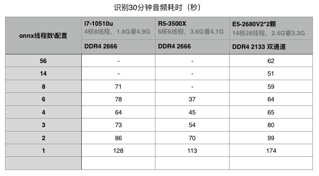
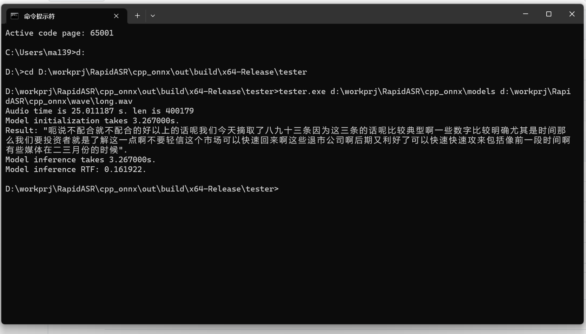

## 快速使用

### Windows

 安装Vs2022 打开cpp_onnx目录下的cmake工程，直接 build即可。 本仓库已经准备好所有相关依赖库。

 Windows下已经预置fftw3及onnxruntime库


### Linux
See the bottom of this page: Building Guidance


###  运行程序

tester  /path/to/models/dir /path/to/wave/file quantize(true or false)

 例如： tester /data/models  /data/test.wav false

/data/models 需要包括如下两个文件： model.onnx 和vocab.txt


## 支持平台
- Windows
- Linux/Unix

## 依赖
- fftw3
- openblas
- onnxruntime

## 导出onnx格式模型文件
安装 modelscope与FunASR，依赖：torch，torchaudio，安装过程[详细参考文档](https://github.com/alibaba-damo-academy/FunASR/wiki)
```shell
pip install "modelscope[audio_asr]" -f https://modelscope.oss-cn-beijing.aliyuncs.com/releases/repo.html
git clone https://github.com/alibaba/FunASR.git && cd FunASR
pip install --editable ./
```
导出onnx模型，[详见](https://github.com/alibaba-damo-academy/FunASR/tree/main/funasr/export)，参考示例，从modelscope中模型导出：

```shell
python -m funasr.export.export_model --model-name damo/speech_paraformer-large_asr_nat-zh-cn-16k-common-vocab8404-pytorch --export-dir ./export --type onnx --quantize False
```

## Building Guidance for Linux/Unix

```
git clone https://github.com/alibaba-damo-academy/FunASR.git && cd funasr/runtime/onnxruntime
mkdir build
cd build
# download an appropriate onnxruntime from https://github.com/microsoft/onnxruntime/releases/tag/v1.14.0
# here we get a copy of onnxruntime for linux 64
wget https://github.com/microsoft/onnxruntime/releases/download/v1.14.0/onnxruntime-linux-x64-1.14.0.tgz
tar -zxvf onnxruntime-linux-x64-1.14.0.tgz
# ls
# onnxruntime-linux-x64-1.14.0  onnxruntime-linux-x64-1.14.0.tgz

#install fftw3-dev
ubuntu: apt install libfftw3-dev
centos: yum install fftw fftw-devel

#install openblas
bash ./third_party/install_openblas.sh

# build
 cmake  -DCMAKE_BUILD_TYPE=release .. -DONNXRUNTIME_DIR=/mnt/c/Users/ma139/RapidASR/cpp_onnx/build/onnxruntime-linux-x64-1.14.0
 make

 # then in the subfolder tester of current direcotry, you will see a program, tester

````

### The structure of a qualified onnxruntime package.
```
onnxruntime_xxx
├───include
└───lib
```

## 线程数与性能关系

测试环境Rocky Linux 8，仅测试cpp版本结果（未测python版本），@acely 

简述：
在3台配置不同的机器上分别编译并测试，在fftw和onnxruntime版本都相同的前提下，识别同一个30分钟的音频文件，分别测试不同onnx线程数量的表现。



目前可以总结出大致规律：

并非onnx线程数越多越好
2线程比1线程提升显著，线程再多则提升较小
线程数等于CPU物理核心数时效率最好
实操建议：

大部分场景用3-4线程性价比最高
低配机器用2线程合适


##  演示



## 注意
本程序只支持 采样率16000hz, 位深16bit的 **单声道** 音频。


## Acknowledge
1. We acknowledge [mayong](https://github.com/RapidAI/RapidASR/tree/main/cpp_onnx) for contributing the onnxruntime(cpp api).
2. We borrowed a lot of code from [FastASR](https://github.com/chenkui164/FastASR) for audio frontend and text-postprocess.
