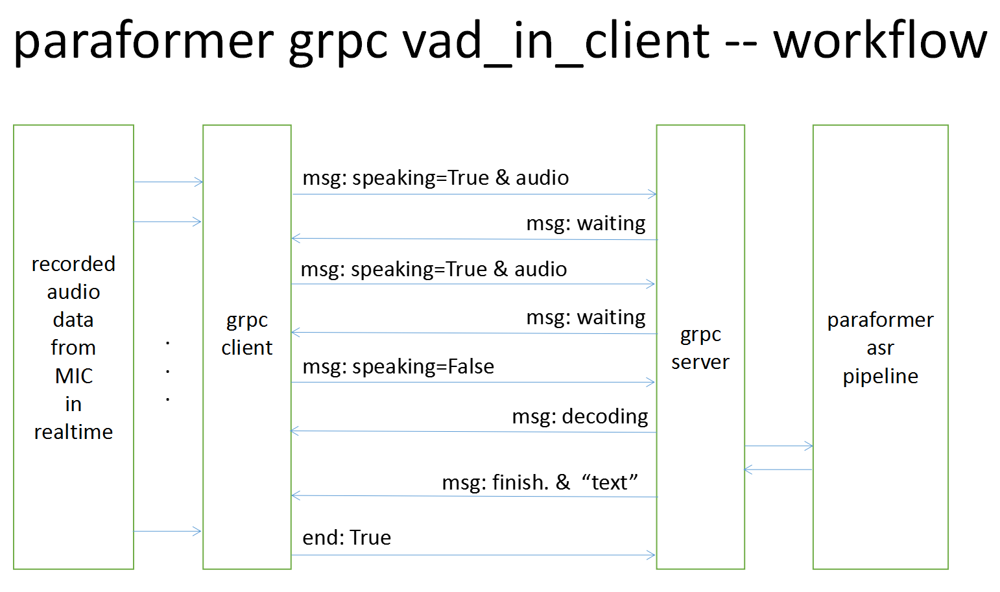

# Service with grpc-python
We can send streaming audio data to server in real-time with grpc client every 10 ms e.g., and get transcribed text when stop speaking.
The audio data is in streaming, the asr inference process is in offline.

## For the Server

### Prepare server environment
#### Backend is modelscope pipeline (default)
Install the modelscope and funasr

```shell
pip install -U modelscope funasr
# For the users in China, you could install with the command:
# pip install -U modelscope funasr -i https://mirror.sjtu.edu.cn/pypi/web/simple
git clone https://github.com/alibaba/FunASR.git && cd FunASR
```

Install the requirements

```shell
cd funasr/runtime/python/grpc
pip install -r requirements_server.txt
```

#### Backend is funasr_onnx (optional)

Install [`funasr_onnx`](https://github.com/alibaba-damo-academy/FunASR/tree/main/funasr/runtime/python/onnxruntime).

```
pip install funasr_onnx -i https://pypi.Python.org/simple
```

Export the model, more details ref to [export docs](https://github.com/alibaba-damo-academy/FunASR/tree/main/funasr/runtime/python/onnxruntime).
```shell
python -m funasr.export.export_model --model-name damo/speech_paraformer-large_asr_nat-zh-cn-16k-common-vocab8404-pytorch --export-dir ./export --type onnx --quantize True
```

### Generate protobuf file
Run on server, the two generated pb files are both used for server and client

```shell
# paraformer_pb2.py and paraformer_pb2_grpc.py are already generated, 
# regenerate it only when you make changes to ./proto/paraformer.proto file.
python -m grpc_tools.protoc  --proto_path=./proto -I ./proto    --python_out=. --grpc_python_out=./ ./proto/paraformer.proto
```

### Start grpc server

```
# Start server.
python grpc_main_server.py --port 10095 --backend pipeline
```

If you want run server with onnxruntime, please set `backend` and `onnx_dir`.
```
# Start server.
python grpc_main_server.py --port 10095 --backend onnxruntime --onnx_dir /models/speech_paraformer-large_asr_nat-zh-cn-16k-common-vocab8404-pytorch
```

## For the client

### Install the requirements

```shell
git clone https://github.com/alibaba/FunASR.git && cd FunASR
cd funasr/runtime/python/grpc
pip install -r requirements_client.txt
```

### Generate protobuf file
Run on server, the two generated pb files are both used for server and client

```shell
# paraformer_pb2.py and paraformer_pb2_grpc.py are already generated, 
# regenerate it only when you make changes to ./proto/paraformer.proto file.
python -m grpc_tools.protoc  --proto_path=./proto -I ./proto    --python_out=. --grpc_python_out=./ ./proto/paraformer.proto
```

### Start grpc client
```
# Start client.
python grpc_main_client_mic.py --host 127.0.0.1 --port 10095
```


## Workflow in desgin

<div align="left">

## Reference
We borrow from or refer to some code as:

1)https://github.com/wenet-e2e/wenet/tree/main/runtime/core/grpc

2)https://github.com/Open-Speech-EkStep/inference_service/blob/main/realtime_inference_service.py