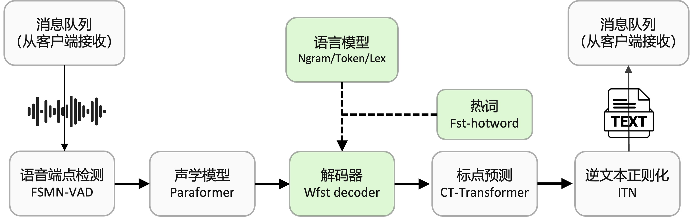

# FunASR离线文件转写服务GPU版本开发指南

(简体中文|[English](SDK_advanced_guide_offline_gpu.md))

FunASR离线文件转写GPU软件包，提供了一款功能强大的语音离线文件转写服务。拥有完整的语音识别链路，结合了语音端点检测、语音识别、标点等模型，可以将几十个小时的长音频与视频识别成带标点的文字，而且支持上百路请求同时进行转写。输出为带标点的文字，含有字级别时间戳，支持ITN与用户自定义热词等。服务端集成有ffmpeg，支持各种音视频格式输入。软件包提供有html、python、c++、java与c#等多种编程语言客户端，用户可以直接使用与进一步开发。

本文档为FunASR离线文件转写服务GPU版本开发指南。如果您想快速体验离线文件转写服务，可参考[快速上手](#快速上手)。



| 时间         | 详情                                                | 镜像版本                         | 镜像ID         |
|------------|---------------------------------------------------|------------------------------|--------------|
| 2024.07.01 | 优化bladedisc模型兼容性问题                  | funasr-runtime-sdk-gpu-0.1.1 | 8875cbf9b99e |
| 2024.06.27 | 离线文件转写服务GPU版本1.0 发布                  | funasr-runtime-sdk-gpu-0.1.0 | b86066f4d018 |

## 服务器配置

用户可以根据自己的业务需求，选择合适的服务器配置，推荐配置为：
- 配置1: （GPU），8核vCPU，内存32G，V100，单机可以支持大约20路的请求

详细性能测试报告（[点击此处](./benchmark_onnx_cpp.md)）

云服务厂商，针对新用户，有3个月免费试用活动，申请教程（[点击此处](https://github.com/alibaba-damo-academy/FunASR/blob/main/runtime/docs/aliyun_server_tutorial.md)）


## 快速上手

### docker安装
如果您已安装docker，忽略本步骤！!
通过下述命令在服务器上安装docker：
```shell
curl -O https://isv-data.oss-cn-hangzhou.aliyuncs.com/ics/MaaS/ASR/shell/install_docker.sh；
sudo bash install_docker.sh
```
docker安装失败请参考 [Docker Installation](https://alibaba-damo-academy.github.io/FunASR/en/installation/docker.html)

### 镜像启动

通过下述命令拉取并启动FunASR软件包的docker镜像：

```shell
sudo docker pull \
  registry.cn-hangzhou.aliyuncs.com/funasr_repo/funasr:funasr-runtime-sdk-gpu-0.1.1
mkdir -p ./funasr-runtime-resources/models
sudo docker run --gpus=all -p 10098:10095 -it --privileged=true \
  -v $PWD/funasr-runtime-resources/models:/workspace/models \
  registry.cn-hangzhou.aliyuncs.com/funasr_repo/funasr:funasr-runtime-sdk-gpu-0.1.1
```

### 服务端启动

docker启动之后，启动 funasr-wss-server服务程序:
```shell
cd FunASR/runtime
nohup bash run_server.sh \
  --download-model-dir /workspace/models \
  --vad-dir damo/speech_fsmn_vad_zh-cn-16k-common-onnx \
  --model-dir damo/speech_paraformer-large-vad-punc_asr_nat-zh-cn-16k-common-vocab8404-pytorch  \
  --punc-dir damo/punc_ct-transformer_cn-en-common-vocab471067-large-onnx \
  --lm-dir damo/speech_ngram_lm_zh-cn-ai-wesp-fst \
  --itn-dir thuduj12/fst_itn_zh \
  --hotword /workspace/models/hotwords.txt > log.txt 2>&1 &

***服务首次启动时会导出torchscript模型，耗时较长，请耐心等待***
# 如果您想关闭ssl，增加参数：--certfile 0
# 默认加载时间戳模型，如果您想使用nn热词模型进行部署，请设置--model-dir为对应模型：
#   damo/speech_paraformer-large-vad-punc_asr_nat-zh-cn-16k-common-vocab8404-pytorch（时间戳）
#   damo/speech_paraformer-large-contextual_asr_nat-zh-cn-16k-common-vocab8404（nn热词）
# 如果您想在服务端加载热词，请在宿主机文件./funasr-runtime-resources/models/hotwords.txt配置热词（docker映射地址为/workspace/models/hotwords.txt）:
#   每行一个热词，格式(热词 权重)：阿里巴巴 20（注：热词理论上无限制，但为了兼顾性能和效果，建议热词长度不超过10，个数不超过1k，权重1~100）
```
如果您想定制ngram，参考文档([如何训练LM](./lm_train_tutorial.md))

服务端详细参数介绍可参考[服务端用法详解](#服务端用法详解)

### 客户端测试与使用

下载客户端测试工具目录samples
```shell
wget https://isv-data.oss-cn-hangzhou.aliyuncs.com/ics/MaaS/ASR/sample/funasr_samples.tar.gz
```
我们以Python语言客户端为例，进行说明，支持多种音频格式输入（.wav, .pcm, .mp3等），也支持视频输入(.mp4等)，以及多文件列表wav.scp输入，其他版本客户端请参考文档（[点击此处](#客户端用法详解)），定制服务部署请参考[如何定制服务部署](#如何定制服务部署)
```shell
python3 funasr_wss_client.py --host "127.0.0.1" --port 10095 --mode offline --audio_in "../audio/asr_example.wav"
```

## 客户端用法详解

在服务器上完成FunASR服务部署以后，可以通过如下的步骤来测试和使用离线文件转写服务。
目前分别支持以下几种编程语言客户端

- [Python](#python-client)
- [CPP](#cpp-client)
- [html网页版本](#Html网页版)
- [Java](#Java-client)

### python-client
若想直接运行client进行测试，可参考如下简易说明，以python版本为例：

```shell
python3 funasr_wss_client.py --host "127.0.0.1" --port 10095 --mode offline \
        --audio_in "../audio/asr_example.wav" --output_dir "./results"
```

命令参数说明：
```text
--host 为FunASR runtime-SDK服务部署机器ip，默认为本机ip（127.0.0.1），如果client与服务不在同一台服务器，
       需要改为部署机器ip
--port 10095 部署端口号
--mode offline表示离线文件转写
--audio_in 需要进行转写的音频文件，支持文件路径，文件列表wav.scp
--thread_num 设置并发发送线程数，默认为1
--ssl 设置是否开启ssl证书校验，默认1开启，设置为0关闭
--hotword 热词文件，每行一个热词，格式(热词 权重)：阿里巴巴 20
--use_itn 设置是否使用itn，默认1开启，设置为0关闭
```

### cpp-client
进入samples/cpp目录后，可以用cpp进行测试，指令如下：
```shell
./funasr-wss-client --server-ip 127.0.0.1 --port 10095 --wav-path ../audio/asr_example.wav
```

命令参数说明：
```text
--server-ip 为FunASR runtime-SDK服务部署机器ip，默认为本机ip（127.0.0.1），如果client与服务不在同一台服务器，
            需要改为部署机器ip
--port 10095 部署端口号
--wav-path 需要进行转写的音频文件，支持文件路径
--hotword 热词文件，每行一个热词，格式(热词 权重)：阿里巴巴 20
--thread-num 设置客户端线程数
--use-itn 设置是否使用itn，默认1开启，设置为0关闭
```

### Html网页版
在浏览器中打开 html/static/index.html，即可出现如下页面，支持麦克风输入与文件上传，直接进行体验


### Java-client
```shell
FunasrWsClient --host localhost --port 10095 --audio_in ./asr_example.wav --mode offline
```
详细可以参考文档（[点击此处](../java/readme.md)）

## 服务端用法详解：

### 启动FunASR服务
```shell
cd /workspace/FunASR/runtime
nohup bash run_server.sh \
  --download-model-dir /workspace/models \
  --model-dir damo/speech_paraformer-large-vad-punc_asr_nat-zh-cn-16k-common-vocab8404-pytorch \
  --vad-dir damo/speech_fsmn_vad_zh-cn-16k-common-onnx \
  --punc-dir damo/punc_ct-transformer_cn-en-common-vocab471067-large-onnx \
  --lm-dir damo/speech_ngram_lm_zh-cn-ai-wesp-fst \
  --itn-dir thuduj12/fst_itn_zh \
  --certfile  ../../../ssl_key/server.crt \
  --keyfile ../../../ssl_key/server.key \
  --hotword ../../hotwords.txt  > log.txt 2>&1 &
 ```
**run_server.sh命令参数介绍**
```text
--download-model-dir 模型下载地址，通过设置model ID从Modelscope下载模型
--model-dir  modelscope model ID 或者 本地模型路径
--vad-dir  modelscope model ID 或者 本地模型路径
--punc-dir  modelscope model ID 或者 本地模型路径
--lm-dir modelscope model ID 或者 本地模型路径
--itn-dir modelscope model ID 或者 本地模型路径
--port  服务端监听的端口号，默认为 10095
--decoder-thread-num  服务端线程池个数(支持的最大并发路数)，
                      **建议每路分配1G显存，即20G显存可配置20路并发**
--io-thread-num  服务端启动的IO线程数
--model-thread-num  每路识别的内部线程数(控制ONNX模型的并行)，默认为 1，
                    其中建议 decoder-thread-num*model-thread-num 等于总线程数
--certfile  ssl的证书文件，默认为：../../../ssl_key/server.crt，如果需要关闭ssl，参数设置为0
--keyfile   ssl的密钥文件，默认为：../../../ssl_key/server.key
--hotword   热词文件路径，每行一个热词，格式：热词 权重(例如:阿里巴巴 20)，
            如果客户端提供热词，则与客户端提供的热词合并一起使用，服务端热词全局生效，客户端热词只针对对应客户端生效。
```

### 关闭FunASR服务
```text
# 查看 funasr-wss-server 对应的PID
ps -x | grep funasr-wss-server
kill -9 PID
```

### 修改模型及其他参数
替换正在使用的模型或者其他参数，需先关闭FunASR服务，修改需要替换的参数，并重新启动FunASR服务。其中模型需为ModelScope中的ASR/VAD/PUNC模型，或者从ModelScope中模型finetune后的模型。
```text
# 例如替换ASR模型为 damo/speech_paraformer-large_asr_nat-zh-cn-16k-common-vocab8404-pytorch，则如下设置参数 --model-dir
    --model-dir damo/speech_paraformer-large_asr_nat-zh-cn-16k-common-vocab8404-pytorch 
# 设置端口号 --port
    --port <port number>
# 设置服务端启动的推理线程数 --decoder-thread-num
    --decoder-thread-num <decoder thread num>
# 设置服务端启动的IO线程数 --io-thread-num
    --io-thread-num <io thread num>
# 关闭SSL证书 
    --certfile 0
```

执行上述指令后，启动离线文件转写服务。如果模型指定为ModelScope中model id，会自动从MoldeScope中下载如下模型：
[FSMN-VAD模型](https://www.modelscope.cn/models/damo/speech_fsmn_vad_zh-cn-16k-common-onnx/summary),
[Paraformer-lagre模型](https://www.modelscope.cn/models/damo/speech_paraformer-large_asr_nat-zh-cn-16k-common-vocab8404-pytorch/summary),
[CT-Transformer标点预测模型](https://www.modelscope.cn/models/damo/punc_ct-transformer_cn-en-common-vocab471067-large-onnx/summary),
[基于FST的中文ITN](https://www.modelscope.cn/models/thuduj12/fst_itn_zh/summary),
[Ngram中文语言模型](https://www.modelscope.cn/models/damo/speech_ngram_lm_zh-cn-ai-wesp-fst/summary)

如果，您希望部署您finetune后的模型（例如10epoch.pb），需要手动将模型重命名为model.pb，并将原modelscope中模型model.pb替换掉，将路径指定为`model_dir`即可。
