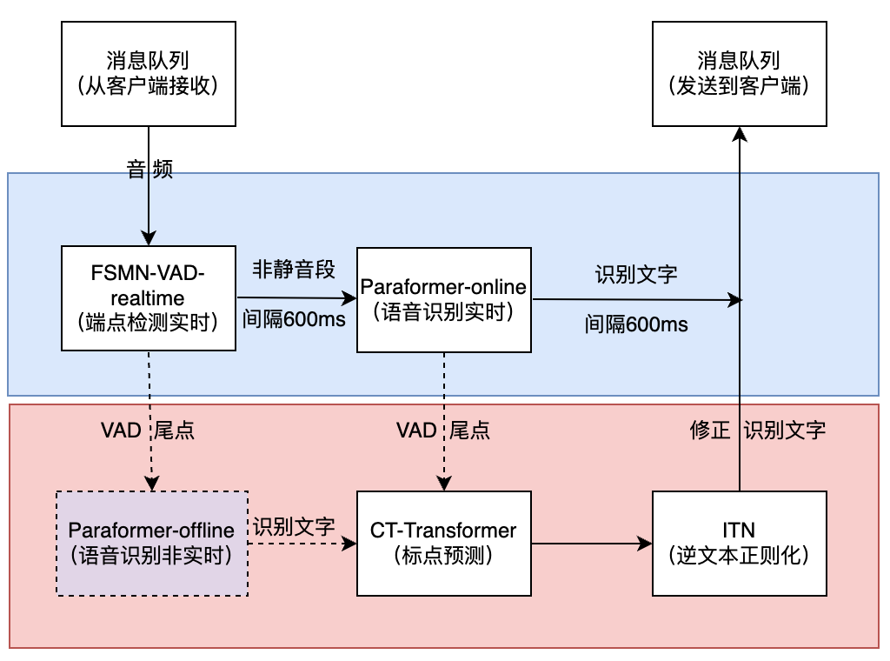

# FunASR实时语音听写服务开发指南
(简体中文|[English](SDK_advanced_guide_online.md))

[//]: # (FunASR提供可便捷本地或者云端服务器部署的实时语音听写服务，内核为FunASR已开源runtime-SDK。)
[//]: # (集成了达摩院语音实验室在Modelscope社区开源的语音端点检测&#40;VAD&#41;、Paraformer-large非流式语音识别&#40;ASR&#41;、Paraformer-large流式语音识别&#40;ASR&#41;、标点&#40;PUNC&#41; 等相关能力。软件包既可以实时地进行语音转文字，而且能够在说话句尾用高精度的转写文字修正输出，输出文字带有标点，支持高并发多路请求)
FunASR实时语音听写软件包，集成了实时版本的语音端点检测模型、语音识别、标点预测模型等。采用多模型协同，既可以实时的进行语音转文字，也可以在说话句尾用高精度转写文字修正输出，输出文字带有标点，支持多路请求。依据使用者场景不同，支持实时语音听写服务（online）、非实时一句话转写（offline）与实时与非实时一体化协同（2pass）3种服务模式。软件包提供有html、python、c++、java与c#等多种编程语言客户端，用户可以直接使用与进一步开发。


本文档为FunASR实时转写服务开发指南。如果您想快速体验实时语音听写服务，可参考[快速上手](#快速上手)。



| 时间         | 详情                                | 镜像版本                                 | 镜像ID         |
|:-----------|:----------------------------------|--------------------------------------|--------------|
| 2024.10.29 | 2pass-offline模式支持SensevoiceSmall模型 | funasr-runtime-sdk-online-cpu-0.1.12 | f5febc5cf13a |
| 2024.09.26 | 修复内存泄漏 | funasr-runtime-sdk-online-cpu-0.1.11 | e51a36c42771 |
| 2024.05.15 | 适配FunASR 1.0模型结构 | funasr-runtime-sdk-online-cpu-0.1.10 | 1c2adfcff84d |
| 2024.03.05 | docker镜像支持arm64平台，升级modelscope版本 | funasr-runtime-sdk-online-cpu-0.1.9 | 4a875e08c7a2 |
| 2024.01.25 | 客户端优化| funasr-runtime-sdk-online-cpu-0.1.7  | 2aa23805572e      |
| 2024.01.03 | 2pass-offline模式支持Ngram语言模型解码、wfst热词，同时修复已知的crash问题及内存泄漏问题 | funasr-runtime-sdk-online-cpu-0.1.6  | f99925110d27      |
| 2023.11.09 | 修复无实时结果问题                         | funasr-runtime-sdk-online-cpu-0.1.5  | b16584b6d38b      |
| 2023.11.08 | 支持服务端加载热词(更新热词通信协议)、runtime结构变化适配 | funasr-runtime-sdk-online-cpu-0.1.4  | 691974017c38 |
| 2023.09.19 | 2pass模式支持热词、时间戳、ITN模型             | funasr-runtime-sdk-online-cpu-0.1.2  | 7222c5319bcf |
| 2023.08.11 | 修复了部分已知的bug(包括server崩溃等)          | funasr-runtime-sdk-online-cpu-0.1.1  | bdbdd0b27dee |
| 2023.08.07 | 1.0 发布                            | funasr-runtime-sdk-online-cpu-0.1.0  | bdbdd0b27dee |


## 快速上手

### docker安装
如果您已安装docker，忽略本步骤！!
通过下述命令在服务器上安装docker：
```shell
curl -O https://isv-data.oss-cn-hangzhou.aliyuncs.com/ics/MaaS/ASR/shell/install_docker.sh
sudo bash install_docker.sh
```
docker安装失败请参考 [Docker Installation](https://alibaba-damo-academy.github.io/FunASR/en/installation/docker.html)

### 镜像启动
通过下述命令拉取并启动FunASR软件包的docker镜像：

```shell
sudo docker pull \
  registry.cn-hangzhou.aliyuncs.com/funasr_repo/funasr:funasr-runtime-sdk-online-cpu-0.1.12
mkdir -p ./funasr-runtime-resources/models
sudo docker run -p 10096:10095 -it --privileged=true \
  -v $PWD/funasr-runtime-resources/models:/workspace/models \
  registry.cn-hangzhou.aliyuncs.com/funasr_repo/funasr:funasr-runtime-sdk-online-cpu-0.1.12
```

### 服务端启动

docker启动之后，启动 funasr-wss-server-2pass服务程序：
```shell
cd FunASR/runtime
nohup bash run_server_2pass.sh \
  --download-model-dir /workspace/models \
  --vad-dir damo/speech_fsmn_vad_zh-cn-16k-common-onnx \
  --model-dir damo/speech_paraformer-large-vad-punc_asr_nat-zh-cn-16k-common-vocab8404-onnx  \
  --online-model-dir damo/speech_paraformer-large_asr_nat-zh-cn-16k-common-vocab8404-online-onnx  \
  --punc-dir damo/punc_ct-transformer_zh-cn-common-vad_realtime-vocab272727-onnx \
  --lm-dir damo/speech_ngram_lm_zh-cn-ai-wesp-fst \
  --itn-dir thuduj12/fst_itn_zh \
  --hotword /workspace/models/hotwords.txt > log.txt 2>&1 &

# 如果您想关闭ssl，增加参数：--certfile 0
# 如果您想使用SenseVoiceSmall模型、时间戳、nn热词模型进行部署，请设置--model-dir为对应模型：
#   iic/SenseVoiceSmall-onnx
#   damo/speech_paraformer-large-vad-punc_asr_nat-zh-cn-16k-common-vocab8404-onnx（时间戳）
#   damo/speech_paraformer-large-contextual_asr_nat-zh-cn-16k-common-vocab8404-onnx（nn热词）
# 如果您想在服务端加载热词，请在宿主机文件./funasr-runtime-resources/models/hotwords.txt配置热词（docker映射地址为/workspace/models/hotwords.txt）:
#   每行一个热词，格式(热词 权重)：阿里巴巴 20（注：热词理论上无限制，但为了兼顾性能和效果，建议热词长度不超过10，个数不超过1k，权重1~100）
# SenseVoiceSmall-onnx识别结果中“<|zh|><|NEUTRAL|><|Speech|> ”分别为对应的语种、情感、事件信息
```
服务端详细参数介绍可参考[服务端用法详解](#服务端用法详解)
### 客户端测试与使用

下载客户端测试工具目录samples
```shell
wget https://isv-data.oss-cn-hangzhou.aliyuncs.com/ics/MaaS/ASR/sample/funasr_samples.tar.gz
```
我们以Python语言客户端为例，进行说明，支持音频格式（.wav, .pcm），以及多文件列表wav.scp输入，其他版本客户端请参考文档（[点击此处](#客户端用法详解)）。
```shell
python3 funasr_wss_client.py --host "127.0.0.1" --port 10096 --mode 2pass
```

------------------

## 客户端用法详解

在服务器上完成FunASR服务部署以后，可以通过如下的步骤来测试和使用离线文件转写服务。
目前分别支持以下几种编程语言客户端

- [Python](./SDK_tutorial_online_zh.md#python-client)
- [CPP](./SDK_tutorial_online_zh.md#cpp-client)
- [html网页版本](./SDK_tutorial_online_zh.md#html-client)
- [Java](./SDK_tutorial_online_zh.md#java-client)
- [c\#](./SDK_tutorial_online_zh.md#c\#)

详细用法可以点击进入查看。更多版本客户端支持请参考[websocket/grpc协议](./websocket_protocol_zh.md)

## 服务端用法详解：

### 启动FunASR服务
```shell
cd /workspace/FunASR/runtime
nohup bash run_server_2pass.sh \
  --model-dir damo/speech_paraformer-large_asr_nat-zh-cn-16k-common-vocab8404-onnx \
  --online-model-dir damo/speech_paraformer-large_asr_nat-zh-cn-16k-common-vocab8404-online-onnx \
  --vad-dir damo/speech_fsmn_vad_zh-cn-16k-common-onnx \
  --punc-dir damo/punc_ct-transformer_zh-cn-common-vad_realtime-vocab272727-onnx \
  --lm-dir damo/speech_ngram_lm_zh-cn-ai-wesp-fst \
  --itn-dir thuduj12/fst_itn_zh \
  --certfile  ../../../ssl_key/server.crt \
  --keyfile ../../../ssl_key/server.key \
  --hotword ../../hotwords.txt > log.txt 2>&1 &
 ```
**run_server_2pass.sh命令参数介绍**
```text
--download-model-dir 模型下载地址，通过设置model ID从Modelscope下载模型
--model-dir  modelscope model ID 或者 本地模型路径
--online-model-dir  modelscope model ID 或者 本地模型路径
--vad-dir  modelscope model ID 或者 本地模型路径
--punc-dir  modelscope model ID 或者 本地模型路径
--lm-dir modelscope model ID 或者 本地模型路径
--itn-dir modelscope model ID 或者 本地模型路径
--port  服务端监听的端口号，默认为 10095
--decoder-thread-num  服务端线程池个数(支持的最大并发路数)，
                      脚本会根据服务器线程数自动配置decoder-thread-num、io-thread-num
--io-thread-num  服务端启动的IO线程数
--model-thread-num  每路识别的内部线程数(控制ONNX模型的并行)，默认为 1，
                    其中建议 decoder-thread-num*model-thread-num 等于总线程数
--certfile  ssl的证书文件，默认为：../../../ssl_key/server.crt，如果需要关闭ssl，参数设置为0
--keyfile   ssl的密钥文件，默认为：../../../ssl_key/server.key
--hotword   热词文件路径，每行一个热词，格式：热词 权重(例如:阿里巴巴 20)，
            如果客户端提供热词，则与客户端提供的热词合并一起使用，服务端热词全局生效，客户端热词只针对对应客户端生效。
```

### 关闭FunASR服务
```text
# 查看 funasr-wss-server-2pass 对应的PID
ps -x | grep funasr-wss-server-2pass
kill -9 PID
```

### 修改模型及其他参数
替换正在使用的模型或者其他参数，需先关闭FunASR服务，修改需要替换的参数，并重新启动FunASR服务。其中模型需为ModelScope中的ASR/VAD/PUNC模型，或者从ModelScope中模型finetune后的模型。
```text
# 例如替换ASR模型为 damo/speech_paraformer-large_asr_nat-zh-cn-16k-common-vocab8404-onnx，则如下设置参数 --model-dir
    --model-dir damo/speech_paraformer-large_asr_nat-zh-cn-16k-common-vocab8404-onnx 
# 设置端口号 --port
    --port <port number>
# 设置服务端启动的推理线程数 --decoder-thread-num
    --decoder-thread-num <decoder thread num>
# 设置服务端启动的IO线程数 --io-thread-num
    --io-thread-num <io thread num>
# 关闭SSL证书 
    --certfile 0
```

执行上述指令后，启动实时语音听写服务。如果模型指定为ModelScope中model id，会自动从MoldeScope中下载如下模型：
[FSMN-VAD模型](https://www.modelscope.cn/models/damo/speech_fsmn_vad_zh-cn-16k-common-onnx/summary),
[Paraformer-lagre实时模型](https://www.modelscope.cn/models/damo/speech_paraformer-large_asr_nat-zh-cn-16k-common-vocab8404-online-onnx/summary ),
[Paraformer-lagre非实时模型](https://www.modelscope.cn/models/damo/speech_paraformer-large_asr_nat-zh-cn-16k-common-vocab8404-onnx/summary),
[CT-Transformer标点预测模型](https://www.modelscope.cn/models/damo/punc_ct-transformer_zh-cn-common-vad_realtime-vocab272727-onnx/summary),
[基于FST的中文ITN](https://www.modelscope.cn/models/thuduj12/fst_itn_zh/summary)

如果，您希望部署您finetune后的模型（例如10epoch.pb），需要手动将模型重命名为model.pb，并将原modelscope中模型model.pb替换掉，将路径指定为`model_dir`即可。

