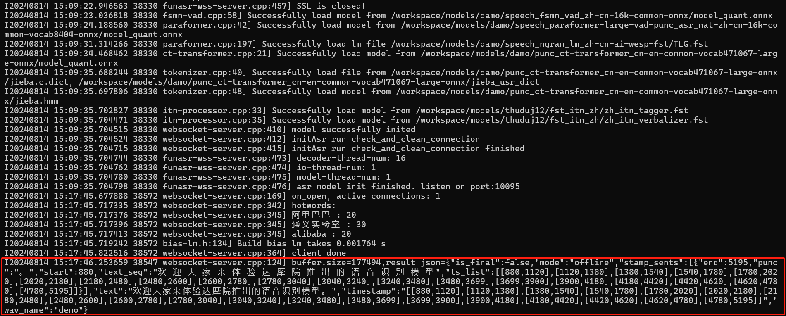
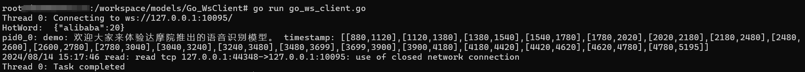
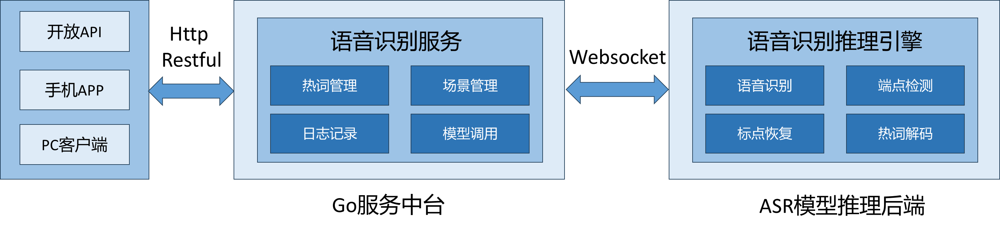

# Golang版本的Websocket客户端-V1.0

本客户端基于Golang编程实现，对接cpp websocket后端(run_server.sh)。为Golang开发者使用FunASR服务提供一点参考。

本客户端开发项目当前仅支持wav格式音频文件的离线模式，对接run_server.sh(关闭ssl)。

## 一 启动命令

### 1.1 服务端启动

run_server.sh的启动命令：

```sh
bash run_server.sh --certfile 0
```

其他参数采取run_server.sh脚本中的默认值。

run_server.sh脚本的详细内容见[官方github](https://github.com/modelscope/FunASR/blob/main/runtime/run_server.sh)，或本文的[附录]()部分。

### 1.2 客户端启动

```go
go run go_ws_client.go
```

命令参数目前是直接赋值给了代码中的变量，在客户端启动时会在main函数读取。

后续可以考虑改为配置文件或命令启动中的参数。

```go
func main() {
	args.audio_in = "../audio/asr_example.wav"
	args.thread_num = 1
	args.host = "127.0.0.1"
	args.port = "10095"
	args.output_dir = "/workspace/models/Outputs"
	args.hotword = "/workspace/models/hotword.txt"
	args.chunk_size = []int{5, 10, 5}
	args.chunk_interval = 10
	args.mode = "offline"
	args.audio_fs = 16000
	args.use_itn = 1
    
    /*
    	more code
    */
}
```


## 二 实现效果

### 2.1 服务端接收情况



### 2.2 客户端返回结果




## 三 未来展望

Golang语言由于自身优秀的并发支持能力，在处理高并发和大规模数据时表现优异，常用于高性能的后端服务和网络应用程序开发，适用于并发和并行处理需求较高的系统。

官方提供的cpp后端支持模型处理的多线程。

因此若有高并发的语音文件识别系统开发需求，需要使用FunASR的run_server服务，可以考虑将Golang作为开发语言，开发客户端与run_server之间的服务中台系统。



## 附录

本Demo中的run_server.sh脚本

```sh
download_model_dir="/workspace/models"
model_dir="damo/speech_paraformer-large-vad-punc_asr_nat-zh-cn-16k-common-vocab8404-onnx"
vad_dir="damo/speech_fsmn_vad_zh-cn-16k-common-onnx"
punc_dir="damo/punc_ct-transformer_cn-en-common-vocab471067-large-onnx"
itn_dir="thuduj12/fst_itn_zh"
lm_dir="damo/speech_ngram_lm_zh-cn-ai-wesp-fst"
port=10095
certfile="$(pwd)/ssl_key/server.crt"
keyfile="$(pwd)/ssl_key/server.key"
hotword="$(pwd)/websocket/hotwords.txt"
# set decoder_thread_num
decoder_thread_num=$(cat /proc/cpuinfo | grep "processor"|wc -l) || { echo "Get cpuinfo failed. Set decoder_thread_num = 32"; decoder_thread_num=32; }
multiple_io=16
io_thread_num=$(( (decoder_thread_num + multiple_io - 1) / multiple_io ))
model_thread_num=1
cmd_path=/workspace/FunASR/runtime/websocket/build/bin
cmd=funasr-wss-server

. ./tools/utils/parse_options.sh || exit 1;

if [ -z "$certfile" ] || [ "$certfile" = "0" ]; then
  certfile=""
  keyfile=""
fi

cd $cmd_path
$cmd_path/${cmd}  \
  --download-model-dir "${download_model_dir}" \
  --model-dir "${model_dir}" \
  --vad-dir "${vad_dir}" \
  --punc-dir "${punc_dir}" \
  --itn-dir "${itn_dir}" \
  --lm-dir "${lm_dir}" \
  --decoder-thread-num ${decoder_thread_num} \
  --model-thread-num ${model_thread_num} \
  --io-thread-num  ${io_thread_num} \
  --port ${port} \
  --certfile  "${certfile}" \
  --keyfile "${keyfile}" \
  --hotword "${hotword}" &

server_cmd="{\"server\":[{\"exec\":\"${cmd_path}/${cmd}\",\"--download-model-dir\":\"${download_model_dir}\",\"--model-dir\":\"${model_dir}\",\"--vad-dir\":\"${vad_dir}\",\"--punc-dir\":\"${punc_dir}\",\"--itn-dir\":\"${itn_dir}\",\"--lm-dir\":\"${lm_dir}\",\"--decoder-thread-num\":\"${decoder_thread_num}\",\"--model-thread-num\":\"${model_thread_num}\",\"--io-thread-num\":\"${io_thread_num}\",\"--port\":\"${port}\",\"--certfile\":\"${certfile}\",\"--keyfile\":\"${keyfile}\",\"--hotword\":\"${hotword}\"}]}"
mkdir -p /workspace/.config
echo $server_cmd > /workspace/.config/server_config
```

