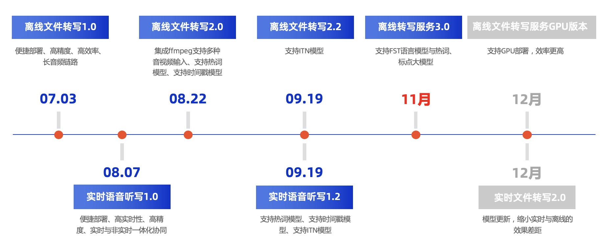

# FunASR软件包路线图

English Version（[docs](./readme.md)）

FunASR是由阿里巴巴通义实验室语音团队开源的一款语音识别基础框架，集成了语音端点检测、语音识别、标点断句等领域的工业级别模型，吸引了众多开发者参与体验和开发。为了解决工业落地的最后一公里，将模型集成到业务中去，我们开发了社区软件包。
支持以下几种服务部署：

- 中文离线文件转写服务（CPU版本），已完成
- 中文流式语音识别服务（CPU版本），已完成
- 英文离线文件转写服务（CPU版本），已完成
- 中文离线文件转写服务（GPU版本），已完成
- 更多支持中

## 中文离线文件转写服务（GPU版本）

中文语音离线文件服务部署（GPU版本），拥有完整的语音识别链路，可以将几十个小时的长音频与视频识别成带标点的文字，而且支持多路请求同时进行转写。
为了支持不同用户的需求，针对不同场景，准备了不同的图文教程：

### 最新动态
- 2024/09/26:   中文离线文件转写服务GPU 2.0 发布，修复显存泄漏，docker镜像版本funasr-runtime-sdk-gpu-0.2.0 (d280bf7e495b)
- 2024/07/01:   中文离线文件转写服务GPU 1.1 发布，优化bladedisc模型兼容性问题，docker镜像版本funasr-runtime-sdk-gpu-0.1.1 (8875cbf9b99e)
- 2024/06/27:   中文离线文件转写服务GPU 1.0 发布，支持动态batch，支持多路并发，在长音频测试集上单线RTF为0.0076，多线加速比为1200+（CPU为330+），详见([文档](./docs/benchmark_libtorch_cpp.md))，docker镜像版本funasr-runtime-sdk-gpu-0.1.0 (b86066f4d018)

### 部署与开发文档

部署模型来自于ModelScope，或者用户finetune，支持用户定制服务，详细文档参考（[点击此处](./docs/SDK_advanced_guide_offline_gpu_zh.md)）

## 英文离线文件转写服务（CPU版本）

英文离线文件转写服务部署（CPU版本），拥有完整的语音识别链路，可以将几十个小时的长音频与视频识别成带标点的文字，而且支持上百路请求同时进行转写。
为了支持不同用户的需求，针对不同场景，准备了不同的图文教程：

### 最新动态
- 2024/09/26:   英文离线文件转写服务 1.7 发布，修复内存泄漏，docker镜像版本funasr-runtime-sdk-en-cpu-0.1.7 (f6c5a7b59eb6)
- 2024/05/15:   英文离线文件转写服务 1.6 发布，适配FunASR 1.0模型结构，docker镜像版本funasr-runtime-sdk-en-cpu-0.1.6 (84d781d07997)
- 2024/03/05:   英文离线文件转写服务 1.5 发布，docker镜像支持arm64平台，升级modelscope版本，docker镜像版本funasr-runtime-sdk-en-cpu-0.1.5 (7cca2abc5901)
- 2024/01/25:   英文离线文件转写服务 1.3 发布，优化vad数据处理方式，大幅降低峰值内存占用，内存泄漏优化，docker镜像版本funasr-runtime-sdk-en-cpu-0.1.3 (c00f9ce7a195)
- 2024/01/03:   英文离线文件转写服务 1.2 发布，修复已知的crash问题及内存泄漏问题，docker镜像版本funasr-runtime-sdk-en-cpu-0.1.2 (0cdd9f4a4bb5)
- 2023/11/08:   英文离线文件转写服务 1.1 发布，runtime结构变化适配（FunASR/funasr/runtime->FunASR/runtime），docker镜像版本funasr-runtime-sdk-en-cpu-0.1.1 (27017f70f72a)
- 2023/10/16:   英文离线文件转写服务 1.0 发布，docker镜像版本funasr-runtime-sdk-en-cpu-0.1.0 (e0de03eb0163)，原理介绍文档（[点击此处](https://mp.weixin.qq.com/s/DZZUTj-6xwFfi-96ml--4A)）

### 部署与开发文档

部署模型来自于ModelScope，或者用户finetune，支持用户定制服务，详细文档参考（[点击此处](./docs/SDK_advanced_guide_offline_en_zh.md)）

## 中文实时语音听写服务（CPU版本）
FunASR实时语音听写服务软件包，既可以实时地进行语音转文字，而且能够在说话句尾用高精度的转写文字修正输出，输出文字带有标点，支持高并发多路请求。
为了支持不同用户的需求，针对不同场景，准备了不同的图文教程：

### 最新动态
- 2024/10/29:   中文实时语音听写服务 1.12 发布，2pass-offline模式支持SensevoiceSmall模型，docker镜像版本funasr-runtime-sdk-online-cpu-0.1.12 (f5febc5cf13a)
- 2024/09/26:   中文实时语音听写服务 1.11 发布，修复内存泄漏，docker镜像版本funasr-runtime-sdk-online-cpu-0.1.11 (e51a36c42771)
- 2024/05/15:   中文实时语音听写服务 1.10 发布，适配FunASR 1.0模型结构，docker镜像版本funasr-runtime-sdk-online-cpu-0.1.10 (1c2adfcff84d)
- 2024/03/05:   中文实时语音听写服务 1.9 发布，docker镜像支持arm64平台，升级modelscope版本，docker镜像版本funasr-runtime-sdk-online-cpu-0.1.9 (4a875e08c7a2)
- 2024/01/25:   中文实时语音听写服务 1.7 发布，客户端优化，docker镜像版本funasr-runtime-sdk-online-cpu-0.1.7 (2aa23805572e)
- 2024/01/03:   中文实时语音听写服务 1.6 发布，2pass-offline模式支持Ngram语言模型解码、wfst热词，同时修复已知的crash问题及内存泄漏问题，docker镜像版本funasr-runtime-sdk-online-cpu-0.1.6 (f99925110d27)
- 2023/11/09:   中文实时语音听写服务 1.5 发布，修复无实时结果的问题，docker镜像版本funasr-runtime-sdk-online-cpu-0.1.5 (b16584b6d38b)
- 2023/11/08:   中文实时语音听写服务 1.4 发布，支持服务端加载热词(更新热词通信协议)、runtime结构变化适配（FunASR/funasr/runtime->FunASR/runtime），docker镜像版本funasr-runtime-sdk-online-cpu-0.1.4 (691974017c38)
- 2023/09/19:   中文实时语音听写服务 1.2 发布，2pass模式支持热词、时间戳、ITN模型，docker镜像版本funasr-runtime-sdk-online-cpu-0.1.2 (7222c5319bcf)
- 2023/08/11:   中文实时语音听写服务 1.1 发布，修复了部分已知的bug(包括server崩溃等)，docker镜像版本funasr-runtime-sdk-online-cpu-0.1.1 (bdbdd0b27dee)
- 2023/08/07:   中文实时语音听写服务 1.0 发布，docker镜像版本funasr-runtime-sdk-online-cpu-0.1.0 (bdbdd0b27dee)，原理介绍文档（[点击此处](https://mp.weixin.qq.com/s/8He081-FM-9IEI4D-lxZ9w)）

### 部署与开发文档

部署模型来自于ModelScope，或者用户finetune，支持用户定制服务，详细文档参考（[点击此处](./docs/SDK_advanced_guide_online_zh.md)）

## 中文离线文件转写服务（CPU版本）

中文语音离线文件服务部署（CPU版本），拥有完整的语音识别链路，可以将几十个小时的长音频与视频识别成带标点的文字，而且支持上百路请求同时进行转写。
为了支持不同用户的需求，针对不同场景，准备了不同的图文教程：

### 最新动态
- 2024/09/26:   中文离线文件转写服务 4.6 发布，修复内存泄漏、支持SensevoiceSmall onnx模型，docker镜像版本funasr-runtime-sdk-cpu-0.4.6 (8651c6b8a1ae)
- 2024/05/15:   中文离线文件转写服务 4.5 发布，适配FunASR 1.0模型结构，docker镜像版本funasr-runtime-sdk-cpu-0.4.5 (058b9882ae67)
- 2024/03/05:   中文离线文件转写服务 4.4 发布，docker镜像支持arm64平台，升级modelscope版本，docker镜像版本funasr-runtime-sdk-cpu-0.4.4 (2dc87b86dc49)
- 2024/01/25:   中文离线文件转写服务 4.2 发布，优化vad数据处理方式，大幅降低峰值内存占用，内存泄漏优化，docker镜像版本funasr-runtime-sdk-cpu-0.4.2 (befdc7b179ed)
- 2024/01/08:   中文离线文件转写服务 4.1 发布，优化句子级时间戳json格式，docker镜像版本funasr-runtime-sdk-cpu-0.4.1 (0250f8ef981b)
- 2024/01/03:   中文离线文件转写服务 4.0 发布，新增支持8k模型、优化时间戳不匹配问题及增加句子级别时间戳、优化英文单词fst热词效果、支持自动化配置线程参数，同时修复已知的crash问题及内存泄漏问题，docker镜像版本funasr-runtime-sdk-cpu-0.4.0 (c4483ee08f04)
- 2023/11/08:   中文离线文件转写服务 3.0 发布，支持标点大模型、支持Ngram模型、支持fst热词(更新热词通信协议)、支持服务端加载热词、runtime结构变化适配（FunASR/funasr/runtime->FunASR/runtime），docker镜像版本funasr-runtime-sdk-cpu-0.3.0 (caa64bddbb43)，原理介绍文档（[点击此处](https://mp.weixin.qq.com/s/jSbnKw_m31BUUbTukPSOIw)）
- 2023/09/19:   中文离线文件转写服务 2.2 发布，支持ITN模型，docker镜像版本funasr-runtime-sdk-cpu-0.2.2 (2c5286be13e9)
- 2023/08/22:   中文离线文件转写服务 2.0 发布，集成ffmpeg支持多种音视频输入、支持热词模型、支持时间戳模型，docker镜像版本funasr-runtime-sdk-cpu-0.2.0 (1ad3d19e0707)，原理介绍文档（[点击此处](https://mp.weixin.qq.com/s/oJHe0MKDqTeuIFH-F7GHMg)）
- 2023/07/03:   中文离线文件转写服务 1.0 发布，docker镜像版本funasr-runtime-sdk-cpu-0.1.0 (1ad3d19e0707)，原理介绍文档（[点击此处](https://mp.weixin.qq.com/s/DHQwbgdBWcda0w_L60iUww)）

### 部署与开发文档

部署模型来自于ModelScope，或者用户finetune，支持用户定制服务，详细文档参考（[点击此处](./docs/SDK_advanced_guide_offline_zh.md)）

